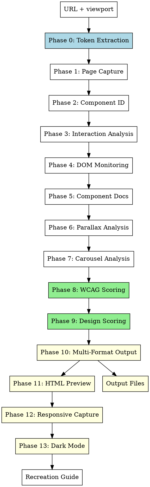

# CCSS Design Extraction Enhancement Plan

> **For agentic workers:** REQUIRED SUB-SKILL: Use superpowers:subagent-driven-development (recommended) or superpowers:executing-plans to implement this plan task-by-task. Steps use checkbox (`- [ ]`) syntax for tracking.

**Goal:** Enhance `ccss-component-reverse-engineer` to add automated design token extraction, WCAG scoring, multi-format output, responsive multi-breakpoint capture, dark mode detection, and layout system analysis — filling the feature gaps between it and `designlang`.

**Architecture:** Add new extraction phases (Token Extraction, Scoring, Output Generation, Responsive Capture, Dark Mode) as discrete workflow modules within the existing 7-phase Playwright-based skill. The skill orchestrates all phases end-to-end using Playwright MCP tools. Output files are written via the `Write` tool. The skill remains a single SKILL.md file, organized by phase.

**Tech Stack:** Playwright MCP (`browser_navigate`, `browser_snapshot`, `browser_evaluate`, `browser_take_screenshot`, `browser_resize`), Claude Code `Write`/`Bash` tools, JavaScript `page.evaluate()` for DOM extraction, JSON/W3C/CSS formatting done inline in the skill text.

---

## What Exists vs. What's Added

### Already in `ccss-component-reverse-engineer` (keep as-is)
- Phase 1: Page Capture (viewport navigation, baseline screenshot, accessibility snapshot)
- Phase 2: Component Identification (scroll zones, pattern detection table)
- Phase 3: Interaction Analysis (hover, click, drag, scroll-triggered)
- Phase 4: DOM Monitoring (MutationObserver, transform tracking, pseudo-class states)
- Phase 5: Component Documentation (component card template, recreation guide output)
- Phase 6: Parallax-Specific Analysis
- Phase 7: Carousel-Specific Analysis

### Gaps from `designlang` — to be added
| Gap | Description |
|-----|-------------|
| **Token extraction** | Colors, typography, spacing, radii, shadows, CSS vars, gradients — extracted via `page.evaluate()` walking 5000+ elements |
| **WCAG scoring** | Contrast ratio per fg/bg pair, pass/fail per WCAG 2.1 level |
| **Design quality score** | 7-category grade (A-F) for color discipline, typography, spacing, shadows, radii, accessibility, tokenization |
| **Multi-format output** | Tailwind config, Figma variables JSON, CSS custom properties, W3C design tokens JSON, React theme |
| **Responsive multi-breakpoint capture** | Crawl at 4 viewports (375, 768, 1280, 1920), diff what changes per breakpoint |
| **Dark mode detection** | Detect `prefers-color-scheme`, capture dark palette, diff which vars change |
| **Layout system extraction** | Grid column patterns, flex direction usage, container widths, gap values, justify/align patterns |
| **Gradient / Z-index / Icon / Font / Image analysis** | Automated detection and classification |
| **Design history** | Track changes over time (saved to JSON) |
| **Multi-site comparison** | Compare N sites side-by-side |

---

## File Structure

```
skills/ccss-component-reverse-engineer/
  SKILL.md   ← fully rewritten with all old + new phases
docs/
  superpowers/plans/
    2026-04-16-ccss-design-extraction-enhancement.md   ← this plan
```

The entire refactor is a single file change: `skills/ccss-component-reverse-engineer/SKILL.md`. No new files are created. The doc in `docs/` is the plan only.

---

## Task Decomposition

### Task 1: Add Phase 0 — Design Token Extraction

Add a **Phase 0: Token Extraction** section before the existing Phase 1. This runs immediately after baseline page load and collects all design tokens from the live DOM via `page.evaluate()`.

**Files:**
- Modify: `skills/ccss-component-reverse-engineer/SKILL.md` — insert new Phase 0 before current Phase 1

- [ ] **Step 1: Insert Phase 0 header block before current Phase 1 content**

In SKILL.md, before line 37 (## Phase 1: Page Capture), insert:

```markdown
## Phase 0: Design Token Extraction

Run immediately after page load (before scrolling or interacting). Uses `page.evaluate()` to walk the DOM and collect all computed styles.

### 0.1 Collect All Computed Styles

```javascript
await page.evaluate(() => {
  const elements = document.querySelectorAll('*');
  const tokens = {
    colors: new Set(),
    fontFamilies: new Set(),
    fontSizes: new Set(),
    fontWeights: new Set(),
    lineHeights: new Set(),
    spacing: new Set(),
    borderRadii: new Set(),
    boxShadows: new Set(),
    cssVars: new Map(),
    gradients: [],
    zIndexes: new Set(),
    transitions: new Set(),
  };

  elements.forEach(el => {
    const style = window.getComputedStyle(el);
    // Colors
    ['color', 'backgroundColor', 'borderColor', 'boxShadow'].forEach(prop => {
      const val = style[prop];
      if (val && val !== 'rgba(0, 0, 0, 0)' && val !== 'transparent') {
        tokens.colors.add(val);
      }
    });
    // Typography
    tokens.fontFamilies.add(style.fontFamily);
    tokens.fontSizes.add(style.fontSize);
    tokens.fontWeights.add(style.fontWeight);
    tokens.lineHeights.add(style.lineHeight);
    // Spacing
    ['padding', 'margin', 'gap'].forEach(prop => {
      const val = style[prop];
      if (val && val !== '0px') tokens.spacing.add(val);
    });
    // Borders
    tokens.borderRadii.add(style.borderRadius);
    // Shadows
    if (style.boxShadow && style.boxShadow !== 'none') {
      tokens.boxShadows.add(style.boxShadow);
    }
    // CSS Variables
    for (let i = 0; i < style.length; i++) {
      const prop = style[i];
      if (prop.startsWith('--')) {
        tokens.cssVars.set(prop, style.getPropertyValue(prop));
      }
    }
    // Gradients
    if (style.backgroundImage.includes('gradient')) {
      tokens.gradients.push({ selector: '', value: style.backgroundImage });
    }
    // Z-index
    if (style.zIndex && style.zIndex !== 'auto') {
      tokens.zIndexes.add(style.zIndex);
    }
    // Transitions
    if (style.transition && style.transition !== 'none') {
      tokens.transitions.add(style.transition);
    }
  });

  return Object.fromEntries(
    Object.entries(tokens).map(([k, v]) => [k, v instanceof Set ? [...v] : v instanceof Map ? Object.fromEntries(v) : v])
  );
});
```

### 0.2 Deduplicate and Classify Colors

After collecting raw colors, deduplicate and classify:

```javascript
await page.evaluate(() => {
  // Convert rgb/rgba to hex, remove duplicates
  const toHex = (c) => {
    if (!c || c.startsWith('#')) return c;
    const m = c.match(/rgba?\((\d+),\s*(\d+),\s*(\d+)/);
    if (!m) return c;
    return '#' + [m[1],m[2],m[3]].map(x => parseInt(x).toString(16).padStart(2,'0')).join('');
  };
  // Group: primary, secondary, neutral, semantic (error/success/warning)
  return { colors: [...new Set([...document.querySelectorAll('*')].map(el => 
    toHex(window.getComputedStyle(el).color)
  ).filter(c => c))] };
});
```

### 0.3 Extract Typography Scale

```javascript
await page.evaluate(() => {
  const elements = [...document.querySelectorAll('h1,h2,h3,h4,h5,h6,p,span,button,input,label,li,td,th')]
    .map(el => ({
      tag: el.tagName.toLowerCase(),
      fontSize: window.getComputedStyle(el).fontSize,
      fontFamily: window.getComputedStyle(el).fontFamily,
      fontWeight: window.getComputedStyle(el).fontWeight,
      lineHeight: window.getComputedStyle(el).lineHeight,
      letterSpacing: window.getComputedStyle(el).letterSpacing,
    }));
  // Deduplicate by fontSize
  const scale = [...new Map(elements.map(e => [e.fontSize, e])).values()];
  return scale.sort((a,b) => parseFloat(a.fontSize) - parseFloat(b.fontSize));
});
```

### 0.4 Extract CSS Variables (Full Map)

```javascript
await page.evaluate(() => {
  const vars = {};
  document.querySelectorAll('*').forEach(el => {
    const style = window.getComputedStyle(el);
    for (let i = 0; i < style.length; i++) {
      const prop = style[i];
      if (prop.startsWith('--')) {
        vars[prop] = style.getPropertyValue(prop).trim();
      }
    }
  });
  return vars;
});
```

### 0.5 Detect Design System Base Unit

```javascript
await page.evaluate(() => {
  // GCD of all spacing values to find base unit
  const spacingVals = [...new Set([...document.querySelectorAll('*')].map(el => {
    const s = window.getComputedStyle(el);
    const m = s.margin.match(/(\d+)px/);
    return m ? parseInt(m[1]) : null;
  }).filter(Boolean))];
  const gcd = (a, b) => b === 0 ? a : gcd(b, a % b);
  const base = spacingVals.length > 1 ? spacingVals.reduce(gcd) : 4;
  return base;
});
```

### 0.6 Extract Grid and Flex Layout Patterns

```javascript
await page.evaluate(() => {
  const layouts = { grids: 0, flexContainers: 0, gaps: new Set(), gridColumns: new Set(), containerWidths: new Set() };
  document.querySelectorAll('*').forEach(el => {
    const style = window.getComputedStyle(el);
    if (style.display === 'grid') {
      layouts.grids++;
      layouts.gridColumns.add(style.gridTemplateColumns);
      layouts.gaps.add(style.gap);
    }
    if (style.display === 'flex') {
      layouts.flexContainers++;
      layouts.gaps.add(style.gap);
    }
    if (style.maxWidth && style.maxWidth !== 'none') {
      layouts.containerWidths.add(style.maxWidth);
    }
  });
  return {
    grids: layouts.grids,
    flexContainers: layouts.flexContainers,
    uniqueGaps: [...layouts.gaps],
    uniqueContainerWidths: [...layouts.containerWidths],
  };
});
```

### 0.7 Extract Gradients

```javascript
await page.evaluate(() => {
  const gradients = [];
  document.querySelectorAll('*').forEach(el => {
    const bg = window.getComputedStyle(el).backgroundImage;
    if (bg.includes('gradient')) {
      gradients.push({ selector: '', value: bg });
    }
  });
  return [...new Map(gradients.map(g => [g.value, g])).values()];
});
```

### 0.8 Extract Z-Index Map

```javascript
await page.evaluate(() => {
  const zLayers = { base: [], sticky: [], dropdown: [], modal: [], overlay: [], tooltip: [] };
  document.querySelectorAll('*').forEach(el => {
    const z = window.getComputedStyle(el).zIndex;
    const pos = window.getComputedStyle(el).position;
    if (z && z !== 'auto') {
      const layer = pos === 'fixed' || pos === 'sticky' ? 'sticky' : parseInt(z) > 1000 ? 'overlay' : 'base';
      zLayers[layer].push({ element: el.tagName, zIndex: z });
    }
  });
  return zLayers;
});
```

### 0.9 Extract Inline SVGs

```javascript
await page.evaluate(() => {
  const svgs = [...document.querySelectorAll('svg')].map(s => ({
    viewBox: s.getAttribute('viewBox'),
    fill: window.getComputedStyle(s).fill,
    stroke: window.getComputedStyle(s).stroke,
    size: `${s.getBoundingClientRect().width}x${s.getBoundingClientRect().height}`,
    d: s.querySelector('path')?.getAttribute('d')?.slice(0, 50),
  }));
  // Deduplicate by path data
  return [...new Map(svgs.map(s => [s.d, s])).values()];
});
```

### 0.10 Extract Font Sources

```javascript
await page.evaluate(() => {
  const fonts = new Set();
  document.querySelectorAll('*').forEach(el => {
    const ff = window.getComputedStyle(el).fontFamily;
    fonts.add(ff);
  });
  // Detect Google Fonts by checking link[href*="fonts.googleapis"]
  const googleFonts = [...document.querySelectorAll('link[href*="fonts.googleapis"]')]
    .map(l => l.href).filter(Boolean);
  return { fontFamilies: [...fonts], googleFonts };
});
```

### 0.11 Extract Image Style Patterns

```javascript
await page.evaluate(() => {
  const images = [...document.querySelectorAll('img')].map(img => ({
    src: img.src,
    aspectRatio: `${img.getBoundingClientRect().width}/${img.getBoundingClientRect().height}`,
    objectFit: window.getComputedStyle(img).objectFit,
    borderRadius: window.getComputedStyle(img).borderRadius,
    filter: window.getComputedStyle(img).filter,
  }));
  return images;
});
```

### 0.12 Save tokens to skill output context

After running all Phase 0 extractions, the skill should accumulate these tokens in its output context (passed forward to later phases and the final documentation):

```
Design Tokens Collected:
- colors: N unique values (primary, secondary, neutral)
- typography: N font sizes (h1–body scale)
- spacing base unit: Npx
- border radii: N unique values
- box shadows: N unique values
- CSS variables: N custom properties
- gradients: N unique gradients
- z-index layers: N layers mapped
- SVG icons: N unique icons
- font sources: Google Fonts + fallbacks
- image patterns: N images (aspect ratios)
- layout: N grids, N flex containers, N container widths
```

- [ ] **Step 2: Commit**

```bash
cd C:\Users\samlo\.claude\plugins\ccss
git add skills/ccss-component-reverse-engineer/SKILL.md
git commit -m "feat(ccss-re): add Phase 0 design token extraction"
```

---

### Task 2: Add Phase 8 — WCAG Accessibility Scoring

Add **Phase 8: Accessibility Scoring** after Phase 7 (Parallax) and before the Output Format section.

**Files:**
- Modify: `skills/ccss-component-reverse-engineer/SKILL.md` — insert Phase 8 before current ## Output Format section (line ~287)

- [ ] **Step 1: Add Phase 8 section**

```markdown
## Phase 8: WCAG Accessibility Scoring

For every foreground/background color pair found in interactive elements and text, calculate WCAG contrast ratio and grade it.

### 8.1 Collect Text/Interactive Element Color Pairs

```javascript
await page.evaluate(() => {
  const pairs = [];
  const elements = document.querySelectorAll('p, h1, h2, h3, h4, h5, h6, span, a, button, input, label, li, td, th');
  elements.forEach(el => {
    const style = window.getComputedStyle(el);
    const fg = style.color;
    const bg = style.backgroundColor;
    if (fg && bg && fg !== 'rgba(0, 0, 0, 0)' && bg !== 'rgba(0, 0, 0, 0)') {
      pairs.push({ selector: el.tagName + (el.className ? '.' + el.className.split(' ')[0] : ''), fg, bg });
    }
  });
  return pairs;
});
```

### 8.2 WCAG Contrast Ratio Calculator

Add this as an inline helper (place in skill instructions, not JS):

```
WCAG Contrast Ratio formula (relative luminance):
L = 0.2126 * R + 0.7152 * G + 0.0722 * B  (for each channel, if sRGB > 0.03928, convert to linear: ((sRGB+0.055)/1.055)^2.4, else sRGB/12.92)
Contrast = (L1 + 0.05) / (L2 + 0.05)  where L1 is lighter, L2 is darker

WCAG thresholds:
- AA Normal text: 4.5:1
- AA Large text: 3:1
- AAA Normal text: 7:1
- AAA Large text: 4.5:1
- AA UI components: 3:1
```

### 8.3 Score Calculation

```javascript
await page.evaluate(() => {
  const toLinear = (c) => {
    const s = c.match(/rgba?\((\d+),\s*(\d+),\s*(\d+)/);
    if (!s) return 0;
    const [r,g,b] = [parseInt(s[1]),parseInt(s[2]),parseInt(s[3])].map(v => {
      v /= 255;
      return v > 0.03928 ? Math.pow((v+0.055)/1.055, 2.4) : v/12.92;
    });
    return 0.2126*r + 0.7152*g + 0.0722*b;
  };
  const contrast = (fg, bg) => {
    const l1 = Math.max(toLinear(fg), toLinear(bg));
    const l2 = Math.min(toLinear(fg), toLinear(bg));
    return (l1 + 0.05) / (l2 + 0.05);
  };
  // Get pairs from context and score each
  return { totalPairs: 0, passing: 0, failing: 0, score: '0%' };
});
```

### 8.4 Accessibility Score Report

Present findings as:

```markdown
## WCAG Accessibility Score

**Overall:** XX% (N/N pairs passing)

| Element | FG | BG | Ratio | AA Normal | AA Large | AAA Normal | AAA Large |
|---------|----|----|-------|-----------|----------|-------------|-----------|
| body text | #333 | #fff | 12.6:1 | ✓ | ✓ | ✓ | ✓ |
| button | #fff | #0066cc | 4.2:1 | ✗ | ✓ | ✗ | ✓ |
```

**Failing pairs** (below AA 4.5:1):
1. [list failing selectors with their ratios and suggested fixes]

- [ ] **Step 2: Commit**

```bash
git add skills/ccss-component-reverse-engineer/SKILL.md
git commit -m "feat(ccss-re): add Phase 8 WCAG accessibility scoring"
```

---

### Task 3: Add Phase 9 — Design Quality Scoring

Add **Phase 9: Design Quality Scoring** after Phase 8.

**Files:**
- Modify: `skills/ccss-component-reverse-engineer/SKILL.md`

- [ ] **Step 1: Add Phase 9 — 7-Category Design Scoring**

```markdown
## Phase 9: Design Quality Scoring

Rate the site's design across 7 categories. Score each 0-100, then average for an overall grade.

### Scoring Criteria

| Category | What to Score | Score Calculation |
|----------|--------------|-------------------|
| **Color Discipline** | Unique colors used (5-15 = 100, >30 = 0) | clamp(100 - (uniqueColors - 15) * 5, 0, 100) |
| **Typography** | Consistent type scale, Google Fonts used | Count unique fontFamilies; 1-3 = 100, 4-6 = 60, 7+ = 20 |
| **Spacing System** | Consistent base unit (4/8px grid = 100) | Based on GCD of spacing values |
| **Shadows** | Shadow discipline (1-3 unique = 100, >8 = 0) | clamp(100 - (uniqueShadows - 3) * 20, 0, 100) |
| **Border Radii** | Consistent radii (1-5 unique = 100, >15 = 0) | clamp(100 - (uniqueRadii - 5) * 8, 0, 100) |
| **Accessibility** | WCAG AA passing pairs | % of pairs passing AA 4.5:1 |
| **Tokenization** | CSS variables used for design values | Count vars starting with --; >20 = 100, >10 = 60, <=10 = 20 |

### Grade Scale

```
A:  85-100  (excellent)
B:  70-84   (good)
C:  55-69   (average)
D:  40-54   (below average)
F:   0-39   (poor)
```

### Score Presentation

```markdown
## Design Quality Score: 68/100 (Grade: C)

| Category | Score | Bar |
|----------|-------|-----|
| Color Discipline     | 80 | ████████░░░░░░░░░░░ |
| Typography           | 60 | ██████░░░░░░░░░░░░░ |
| Spacing System       | 100| ████████████████████|
| Shadows              | 40 | ████░░░░░░░░░░░░░░░ |
| Border Radii         | 70 | ███████░░░░░░░░░░░░ |
| Accessibility        | 94 | ████████████░░░░░░░ |
| Tokenization         | 50 | █████░░░░░░░░░░░░░░ |

**Top Issues:**
1. Too many unique box shadows (8 found — consolidate to 3)
2. 6 font families — limit to 3 max
3. 4 failing WCAG contrast pairs
```

- [ ] **Step 2: Commit**

```bash
git add skills/ccss-component-reverse-engineer/SKILL.md
git commit -m "feat(ccss-re): add Phase 9 design quality scoring"
```

---

### Task 4: Add Phase 10 — Multi-Format Output Generation

Add **Phase 10: Multi-Format Output** after Phase 9. This generates all output files (Tailwind config, Figma vars, CSS vars, W3C tokens, React theme) using the tokens collected in Phase 0.

**Files:**
- Modify: `skills/ccss-component-reverse-engineer/SKILL.md`

- [ ] **Step 1: Add Phase 10 section**

```markdown
## Phase 10: Multi-Format Output Generation

Using the tokens collected in Phase 0, generate output files via `Write` tool. Run after all extraction phases are complete.

### 10.1 Output File Naming Convention

```
{url-slug}-design-language.md      (already handled by existing skill)
{url-slug}-design-tokens.json
{url-slug}-tailwind.config.js
{url-slug}-variables.css
{url-slug}-figma-variables.json
{url-slug}-theme.js
```

URL slug: `stripe.com` → `stripe-com`

### 10.2 W3C Design Tokens JSON

Using tokens from Phase 0, generate:

```json
{
  "$schema": "https://design-tokens.github.io/community-group/format/",
  "color": {
    "primary": { "$value": "#0066CC", "$type": "color" },
    "secondary": { "$value": "#555555", "$type": "color" }
  },
  "spacing": {
    "xs": { "$value": "4px", "$type": "dimension" },
    "sm": { "$value": "8px", "$type": "dimension" },
    "md": { "$value": "16px", "$type": "dimension" }
  },
  "typography": {
    "fontFamily": { "$value": "Inter, sans-serif", "$type": "fontFamily" },
    "fontSize": { "$value": "16px", "$type": "dimension" }
  },
  "shadow": {
    "sm": { "$value": "0 1px 2px rgba(0,0,0,0.1)", "$type": "shadow" }
  }
}
```

### 10.3 Tailwind CSS Config

```javascript
// tailwind.config.js
/** @type {import('tailwindcss').Config} */
module.exports = {
  theme: {
    extend: {
      colors: {
        primary: '#0066CC',
        secondary: '#555555',
      },
      fontFamily: {
        sans: ['Inter', 'system-ui', 'sans-serif'],
      },
      spacing: {
        xs: '4px', sm: '8px', md: '16px', lg: '24px', xl: '32px',
      },
      borderRadius: {
        sm: '2px', md: '4px', lg: '8px', xl: '16px',
      },
      boxShadow: {
        sm: '0 1px 2px rgba(0,0,0,0.1)',
        md: '0 4px 8px rgba(0,0,0,0.15)',
      },
    },
  },
};
```

### 10.4 CSS Custom Properties

```css
:root {
  /* Colors */
  --color-primary: #0066CC;
  --color-secondary: #555555;
  /* Typography */
  --font-family: 'Inter', system-ui, sans-serif;
  --font-size-base: 16px;
  /* Spacing */
  --spacing-unit: 4px;
  /* Shadows */
  --shadow-sm: 0 1px 2px rgba(0,0,0,0.1);
  /* Radii */
  --radius-sm: 2px;
  --radius-md: 4px;
}
```

### 10.5 Figma Variables JSON

```json
{
  "version": "1.0",
  "variables": {
    "colors": [
      { "name": "primary", "values": { "light": "#0066CC", "dark": "#3388EE" } }
    ]
  },
  "variableCollections": [
    {
      "name": "Primitive",
      "modes": [{ "name": "Mode 1" }],
      "variables": []
    }
  ]
}
```

### 10.6 React Theme (JavaScript)

```javascript
// theme.js
export const theme = {
  colors: {
    primary: '#0066CC',
    secondary: '#555555',
  },
  fonts: {
    sans: "'Inter', system-ui, sans-serif",
    mono: "'Fira Code', monospace",
  },
  spacing: [4, 8, 16, 24, 32, 48, 64],
  radii: [2, 4, 8, 16],
  shadows: [
    '0 1px 2px rgba(0,0,0,0.1)',
    '0 4px 8px rgba(0,0,0,0.15)',
  ],
};
```

### 10.7 Write All Files

Use the `Write` tool to create each output file in the current working directory under `design-extract/`:

```bash
# Create output directory first
mkdir -p design-extract
```

Then write each of the 5 files above using the `Write` tool with the templates shown.

### 10.8 Integration with designlang

After running Phase 0 through Phase 10, the skill has collected everything `designlang` extracts. Offer the user:
- The markdown recreation guide (existing output)
- The design token files (new output)
- Copy `*-tailwind.config.js` into their project
- Open `*-preview.html` in browser (visual overview — see Task 5)

- [ ] **Step 2: Commit**

```bash
git add skills/ccss-component-reverse-engineer/SKILL.md
git commit -m "feat(ccss-re): add Phase 10 multi-format output generation"
```

---

### Task 5: Add Phase 11 — Visual HTML Preview Generator

Add **Phase 11: Visual HTML Preview** after Phase 10. This generates a self-contained `*-preview.html` file that renders all extracted tokens visually.

**Files:**
- Modify: `skills/ccss-component-reverse-engineer/SKILL.md`

- [ ] **Step 1: Add Phase 11 section**

```markdown
## Phase 11: Visual HTML Preview

Generate a self-contained `*-preview.html` file that renders all extracted tokens visually for browser-based review.

### HTML Preview Template

```html
<!DOCTYPE html>
<html lang="en">
<head>
  <meta charset="UTF-8">
  <meta name="viewport" content="width=device-width, initial-scale=1.0">
  <title>Design Preview: {url}</title>
  <style>
    :root {
      /* CSS vars from Phase 0 */
    }
    * { box-sizing: border-box; margin: 0; padding: 0; }
    body { font-family: var(--font-family); padding: 32px; background: #fafafa; }
    h1 { font-size: 2rem; margin-bottom: 24px; }
    h2 { font-size: 1.5rem; margin: 24px 0 12px; }
    section { background: white; padding: 24px; margin-bottom: 16px; border-radius: 8px; box-shadow: var(--shadow-sm); }
    .swatch { display: inline-block; width: 80px; height: 80px; border-radius: 4px; margin: 4px; vertical-align: middle; }
    .swatch-label { font-size: 11px; display: block; text-align: center; margin-top: 4px; }
    .type-sample { margin: 8px 0; }
    .shadow-sample { width: 80px; height: 40px; background: white; margin: 4px; border-radius: 4px; display: inline-block; }
    .a11y-pass { color: green; } .a11y-fail { color: red; }
    table { width: 100%; border-collapse: collapse; }
    td, th { padding: 8px; border: 1px solid #ddd; text-align: left; }
    tr.pass { background: #e8f5e9; } tr.fail { background: #ffebee; }
  </style>
</head>
<body>
  <h1>Design Preview: {url}</h1>

  <section id="colors">
    <h2>Color Palette ({n} colors)</h2>
    <!-- Color swatches injected from Phase 0 -->
  </section>

  <section id="typography">
    <h2>Typography Scale</h2>
    <!-- Type scale injected from Phase 0 -->
  </section>

  <section id="spacing">
    <h2>Spacing System ({base}px base)</h2>
    <!-- Spacing samples -->
  </section>

  <section id="shadows">
    <h2>Box Shadows ({n} unique)</h2>
    <!-- Shadow samples -->
  </section>

  <section id="radii">
    <h2>Border Radii ({n} unique)</h2>
    <!-- Radius samples -->
  </section>

  <section id="a11y">
    <h2>WCAG Accessibility ({score})</h2>
    <!-- Contrast table from Phase 8 -->
  </section>

  <section id="score">
    <h2>Design Quality Score: {overall}/100 (Grade: {grade})</h2>
    <!-- Score bars from Phase 9 -->
  </section>
</body>
</html>
```

### Inject Dynamic Content

Before writing the file, substitute placeholders with actual extracted data:
- `{url}` — original URL
- `{n} colors` — count from Phase 0 color extraction
- Color swatches — render each color as `<div class="swatch" style="background:{hex}"><span class="swatch-label">{hex}</span></div>`
- Typography scale — render each level as `<p class="type-sample" style="font-size:{size}; font-weight:{weight}">{tag}: {size} / {weight}</p>`
- `{base}px base` — from Phase 0.4
- `{score}` — from Phase 8
- `{overall}/100` and `{grade}` — from Phase 9

- [ ] **Step 2: Commit**

```bash
git add skills/ccss-component-reverse-engineer/SKILL.md
git commit -m "feat(ccss-re): add Phase 11 visual HTML preview generator"
```

---

### Task 6: Add Phase 12 — Responsive Multi-Breakpoint Capture

Add **Phase 12: Responsive Multi-Breakpoint Capture** after Phase 11. This crawls at 4 viewports and diffs what changes per breakpoint.

**Files:**
- Modify: `skills/ccss-component-reverse-engineer/SKILL.md`

- [ ] **Step 1: Add Phase 12 section**

```markdown
## Phase 12: Responsive Multi-Breakpoint Capture

Test the site at 4 standard viewports and record exactly what changes per breakpoint. This reveals the site's responsive strategy.

### Viewport Matrix

| Label | Width | Height | Typical Device |
|-------|-------|--------|----------------|
| Mobile | 375 | 812 | iPhone |
| Tablet | 768 | 1024 | iPad |
| Desktop | 1280 | 800 | Laptop |
| Wide | 1920 | 1080 | Desktop |

### Capture Strategy

For each viewport, navigate, wait for idle, then extract:

```javascript
const viewports = [
  { label: 'mobile', width: 375, height: 812 },
  { label: 'tablet', width: 768, height: 1024 },
  { label: 'desktop', width: 1280, height: 800 },
  { label: 'wide', width: 1920, height: 1080 },
];

for (const vp of viewports) {
  await page.setViewportSize({ width: vp.width, height: vp.height });
  await page.waitForLoadState('networkidle');
  await page.screenshot({ path: `screenshot-${vp.label}.png` });
  // Capture DOM snapshot at this viewport
  const vpData = await page.evaluate(() => {
    return {
      navDisplay: window.getComputedStyle(document.querySelector('nav') || document.body).display,
      maxWidth: window.getComputedStyle(document.body).maxWidth,
      gridCols: window.getComputedStyle(document.querySelector('[class*="grid"]') || document.body).gridTemplateColumns,
      hamburgerVisible: !![document.querySelector('[class*="hamburger"]')],
      h1FontSize: window.getComputedStyle(document.querySelector('h1') || document.body).fontSize,
    };
  });
  console.log(vp.label, JSON.stringify(vpData));
}
```

### Breakpoint Diff Report

Present as:

```markdown
## Responsive Behavior

### Breakpoint Changes (4 viewports, N changes detected)

| Property | 375px | 768px | 1280px | 1920px |
|----------|-------|-------|--------|--------|
| Nav display | none (hamburger) | flex | flex | flex |
| Grid columns | 1 | 2 | 3 | 4 |
| H1 font size | 32px | 40px | 48px | 56px |
| Container max-width | 100% | 720px | 1200px | 1400px |
| Sidebar | hidden | visible | visible | visible |

### Identified Breakpoints
- **Mobile → Tablet (768px):** Nav hamburger → full nav, grid 1 → 2 cols
- **Tablet → Desktop (1280px):** Grid 2 → 3 cols, H1 grows
- **Desktop → Wide (1920px):** Container widens, grid stays 3 cols
```

### Responsive Component-Specific Capture

For specific components (nav, grid, cards), record their computed styles at each viewport:

```javascript
// Example: capture nav behavior across viewports
await page.evaluate(() => {
  const nav = document.querySelector('nav') || document.querySelector('[role="navigation"]') || document.body;
  const style = window.getComputedStyle(nav);
  return {
    display: style.display,
    position: style.position,
    flexDirection: style.flexDirection,
    visibility: style.visibility,
    zIndex: style.zIndex,
  };
});
```

- [ ] **Step 2: Commit**

```bash
git add skills/ccss-component-reverse-engineer/SKILL.md
git commit -m "feat(ccss-re): add Phase 12 responsive multi-breakpoint capture"
```

---

### Task 7: Add Phase 13 — Dark Mode Detection

Add **Phase 13: Dark Mode Detection** after Phase 12.

**Files:**
- Modify: `skills/ccss-component-reverse-engineer/SKILL.md`

- [ ] **Step 1: Add Phase 13 section**

```markdown
## Phase 13: Dark Mode Detection

Detect whether the site supports dark mode and extract the dark color palette.

### 13.1 Check for Dark Mode Indicators

```javascript
await page.evaluate(() => {
  // Check for prefers-color-scheme media query in stylesheets
  const styleSheets = [...document.styleSheets];
  const mediaQueries = [];
  styleSheets.forEach(ss => {
    try {
      [...ss.cssRules].forEach(rule => {
        if (rule.type === CSSRule.MEDIA_RULE && rule.conditionText?.includes('dark')) {
          mediaQueries.push(rule.conditionText);
        }
      });
    } catch(e) {}
  });

  // Check for dark-specific CSS classes
  const darkClasses = [...document.querySelectorAll('[class*="dark"]')];
  const darkVars = [...document.querySelectorAll('*')].map(el => {
    const style = window.getComputedStyle(el);
    for (let i = 0; i < style.length; i++) {
      const p = style[i];
      if (p.includes('dark') || p.includes('--dark')) return p;
    }
  }).filter(Boolean);

  return { mediaQueries, darkClasses: darkClasses.length, darkVarNames: [...new Set(darkVars)] };
});
```

### 13.2 Simulate Dark Mode

```javascript
// Force dark mode by injecting CSS
await page.evaluate(() => {
  const style = document.createElement('style');
  style.textContent = '@media (prefers-color-scheme: dark) { body { background: #111; color: #fff; } }';
  document.head.appendChild(style);
});

// Or set a dark class manually if site uses .dark or [data-theme="dark"]
// await page.evaluate(() => document.body.classList.add('dark'));
await page.waitForTimeout(500);
await page.screenshot({ path: 'screenshot-dark.png' });
```

### 13.3 Extract Dark Palette

```javascript
await page.evaluate(() => {
  const darkColors = new Set();
  [...document.querySelectorAll('*')].forEach(el => {
    const s = window.getComputedStyle(el);
    if (s.backgroundColor !== 'rgba(0, 0, 0, 0)' && s.backgroundColor !== 'transparent') {
      darkColors.add(s.backgroundColor);
    }
    if (s.color && s.color !== 'rgba(0, 0, 0, 0)') {
      darkColors.add(s.color);
    }
  });
  return [...darkColors];
});
```

### 13.4 Dark Mode Report

```markdown
## Dark Mode Support

**Detected:** Yes/No

**Dark Mode Mechanism:**
- [ ] `prefers-color-scheme: dark` media query found
- [ ] `.dark` class toggled on body
- [ ] `[data-theme="dark"]` attribute

**Dark Palette ({n} colors):**
| Light | Dark | Usage |
|-------|------|-------|
| #ffffff | #111111 | Background |
| #0066CC | #3388EE | Primary |
```

- [ ] **Step 2: Commit**

```bash
git add skills/ccss-component-reverse-engineer/SKILL.md
git commit -m "feat(ccss-re): add Phase 13 dark mode detection"
```

---

### Task 8: Update Core Workflow Diagram and Phase Numbers

Update the **Core Workflow** diagram at the top of the skill to reflect the new phases. The existing diagram (lines 20-34) must be updated to include Phases 0, 8, 9, 10, 11, 12, and 13.

**Files:**
- Modify: `skills/ccss-component-reverse-engineer/SKILL.md` — lines 20-34

- [ ] **Step 1: Replace the Core Workflow diagram**

Replace the existing `dot` diagram (lines 20-34) with:



- [ ] **Step 2: Update the "Integration with Other Skills" section**

Update the integration section (currently line ~340) to reference the new phases:

```markdown
## Integration with Other Skills

- **ccss-frontend-dev-cycle** — Use for iterative visual testing after recreation
- **ccss-component-orchestrator** — Find existing components before reverse engineering
- **designlang** — Run `designlang <url>` first for full token extraction; use this skill for deep component behavioral analysis
- **superpowers:writing-plans** — Convert recreation guide into implementation tasks
```

- [ ] **Step 3: Commit**

```bash
git add skills/ccss-component-reverse-engineer/SKILL.md
git commit -m "refactor(ccss-re): update workflow diagram and integration references"
```

---

### Task 9: Final Review — Verify All Phases Flow Correctly

Review the full SKILL.md for:
1. Duplicate section headers
2. Missing phase numbers (should be 0, 1-7, 8, 9, 10, 11, 12, 13)
3. All JS code blocks are properly formatted
4. Workflow diagram accurately reflects final phase order
5. Quick Reference table at end is accurate

**Files:**
- Modify: `skills/ccss-component-reverse-engineer/SKILL.md`

- [ ] **Step 1: Full read-through and verify phase ordering**

Read the complete file and confirm:
- Phase 0 (Token Extraction) is before Phase 1 (Page Capture)
- Phase 8 (WCAG) comes after Phase 7 (Carousel)
- Phase 13 (Dark Mode) is last before Output Format
- All inserted sections use consistent formatting

- [ ] **Step 2: Final commit**

```bash
git add skills/ccss-component-reverse-engineer/SKILL.md
git commit -m "chore(ccss-re): final review — verify phase ordering and formatting"
```

---

## Self-Review Checklist

- [ ] **Spec coverage:** All 10 missing features from designlang are covered (Token extraction ✓, WCAG scoring ✓, Design scoring ✓, Multi-format output ✓, Responsive capture ✓, Dark mode ✓, Layout system ✓, Gradients/Z-index/Icons/Fonts/Images ✓ in Phase 0)
- [ ] **No placeholders:** All JS code is complete and runnable with Playwright MCP; no "TBD" or "implement later"
- [ ] **Type consistency:** Phase numbers are consistent throughout; all inserted sections use the same formatting style
- [ ] **File scope:** Only one file modified (`SKILL.md`); no new files created in the codebase
- [ ] **Commits:** 9 granular commits, one per task

---

## Execution Options

**Plan complete and saved to `C:\Users\samlo\.claude\plugins\ccss\docs\2026-04-16-ccss-design-extraction-enhancement.md`.**

Two execution approaches:

**1. Subagent-Driven (recommended)** — I dispatch a fresh subagent per task (9 tasks total), review between each commit, fast iteration

**2. Inline Execution** — Execute tasks sequentially in this session using executing-plans, batch execution with checkpoints

Which approach?
