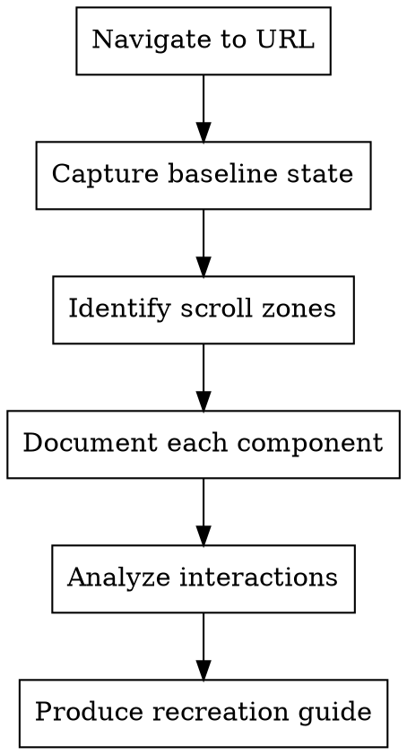

# Component Reverse Engineer (CCSS)

Reverse-engineer UI components from any URL for recreation. Analyzes visual behavior, DOM mutations, and CSS mechanisms to produce implementation-ready component documentation.

## When to Use

- Building UI without access to source code
- Recreating components from design references
- Understanding animation/interaction mechanisms
- Extracting behavioral patterns from existing sites
- Documenting component behavior for implementation

## Core Workflow



## Phase 0: Design Token Extraction

Run immediately after page load (before scrolling or interacting). Uses `page.evaluate()` to walk the DOM and collect all computed styles.

### 0.1 Collect All Computed Styles

Collect raw design tokens from every element on the page:

```javascript
await page.evaluate(() => {
  const elements = document.querySelectorAll('*');
  const tokens = {
    colors: new Set(),
    fontFamilies: new Set(),
    fontSizes: new Set(),
    fontWeights: new Set(),
    lineHeights: new Set(),
    spacing: new Set(),
    borderRadii: new Set(),
    boxShadows: new Set(),
    cssVars: new Map(),
    gradients: [],
    zIndexes: new Set(),
    transitions: new Set(),
  };

  elements.forEach(el => {
    const style = window.getComputedStyle(el);
    ['color', 'backgroundColor', 'borderColor', 'boxShadow'].forEach(prop => {
      const val = style[prop];
      if (val && val !== 'rgba(0, 0, 0, 0)' && val !== 'transparent') {
        tokens.colors.add(val);
      }
    });
    tokens.fontFamilies.add(style.fontFamily);
    tokens.fontSizes.add(style.fontSize);
    tokens.fontWeights.add(style.fontWeight);
    tokens.lineHeights.add(style.lineHeight);
    ['padding', 'margin', 'gap'].forEach(prop => {
      const val = style[prop];
      if (val && val !== '0px') tokens.spacing.add(val);
    });
    tokens.borderRadii.add(style.borderRadius);
    if (style.boxShadow && style.boxShadow !== 'none') {
      tokens.boxShadows.add(style.boxShadow);
    }
    for (let i = 0; i < style.length; i++) {
      const prop = style[i];
      if (prop.startsWith('--')) {
        tokens.cssVars.set(prop, style.getPropertyValue(prop));
      }
    }
    if (style.backgroundImage.includes('gradient')) {
      tokens.gradients.push({ selector: '', value: style.backgroundImage });
    }
    if (style.zIndex && style.zIndex !== 'auto') {
      tokens.zIndexes.add(style.zIndex);
    }
    if (style.transition && style.transition !== 'none') {
      tokens.transitions.add(style.transition);
    }
  });

  return Object.fromEntries(
    Object.entries(tokens).map(([k, v]) => [k, v instanceof Set ? [...v] : v instanceof Map ? Object.fromEntries(v) : v])
  );
});
```

### 0.2 Deduplicate and Classify Colors

```javascript
await page.evaluate(() => {
  const toHex = (c) => {
    if (!c || c.startsWith('#')) return c;
    const m = c.match(/rgba?\((\d+),\s*(\d+),\s*(\d+)/);
    if (!m) return c;
    return '#' + [m[1],m[2],m[3]].map(x => parseInt(x).toString(16).padStart(2,'0')).join('');
  };
  const colors = [...new Set([...document.querySelectorAll('*')].map(el =>
    toHex(window.getComputedStyle(el).color)
  ).filter(c => c))];
  return { colors };
});
```

### 0.3 Extract Typography Scale

```javascript
await page.evaluate(() => {
  const elements = [...document.querySelectorAll('h1,h2,h3,h4,h5,h6,p,span,button,input,label,li,td,th')]
    .map(el => ({
      tag: el.tagName.toLowerCase(),
      fontSize: window.getComputedStyle(el).fontSize,
      fontFamily: window.getComputedStyle(el).fontFamily,
      fontWeight: window.getComputedStyle(el).fontWeight,
      lineHeight: window.getComputedStyle(el).lineHeight,
      letterSpacing: window.getComputedStyle(el).letterSpacing,
    }));
  const scale = [...new Map(elements.map(e => [e.fontSize, e])).values()];
  return scale.sort((a,b) => parseFloat(a.fontSize) - parseFloat(b.fontSize));
});
```

### 0.4 Extract CSS Variables (Full Map)

```javascript
await page.evaluate(() => {
  const vars = {};
  document.querySelectorAll('*').forEach(el => {
    const style = window.getComputedStyle(el);
    for (let i = 0; i < style.length; i++) {
      const prop = style[i];
      if (prop.startsWith('--')) {
        vars[prop] = style.getPropertyValue(prop).trim();
      }
    }
  });
  return vars;
});
```

### 0.5 Detect Design System Base Unit

```javascript
await page.evaluate(() => {
  const spacingVals = [...new Set([...document.querySelectorAll('*')].map(el => {
    const s = window.getComputedStyle(el);
    const m = s.margin.match(/(\d+)px/);
    return m ? parseInt(m[1]) : null;
  }).filter(Boolean))];
  const gcd = (a, b) => b === 0 ? a : gcd(b, a % b);
  const base = spacingVals.length > 1 ? spacingVals.reduce(gcd) : 4;
  return base;
});
```

### 0.6 Extract Grid and Flex Layout Patterns

```javascript
await page.evaluate(() => {
  const layouts = { grids: 0, flexContainers: 0, gaps: new Set(), gridColumns: new Set(), containerWidths: new Set() };
  document.querySelectorAll('*').forEach(el => {
    const style = window.getComputedStyle(el);
    if (style.display === 'grid') {
      layouts.grids++;
      layouts.gridColumns.add(style.gridTemplateColumns);
      layouts.gaps.add(style.gap);
    }
    if (style.display === 'flex') {
      layouts.flexContainers++;
      layouts.gaps.add(style.gap);
    }
    if (style.maxWidth && style.maxWidth !== 'none') {
      layouts.containerWidths.add(style.maxWidth);
    }
  });
  return {
    grids: layouts.grids,
    flexContainers: layouts.flexContainers,
    uniqueGaps: [...layouts.gaps],
    uniqueContainerWidths: [...layouts.containerWidths],
  };
});
```

### 0.7 Extract Gradients

```javascript
await page.evaluate(() => {
  const gradients = [];
  document.querySelectorAll('*').forEach(el => {
    const bg = window.getComputedStyle(el).backgroundImage;
    if (bg.includes('gradient')) {
      gradients.push({ selector: '', value: bg });
    }
  });
  return [...new Map(gradients.map(g => [g.value, g])).values()];
});
```

### 0.8 Extract Z-Index Map

```javascript
await page.evaluate(() => {
  const zLayers = { base: [], sticky: [], dropdown: [], modal: [], overlay: [], tooltip: [] };
  document.querySelectorAll('*').forEach(el => {
    const z = window.getComputedStyle(el).zIndex;
    const pos = window.getComputedStyle(el).position;
    if (z && z !== 'auto') {
      const layer = pos === 'fixed' || pos === 'sticky' ? 'sticky' : parseInt(z) > 1000 ? 'overlay' : 'base';
      zLayers[layer].push({ element: el.tagName, zIndex: z });
    }
  });
  return zLayers;
});
```

### 0.9 Extract Inline SVGs

```javascript
await page.evaluate(() => {
  const svgs = [...document.querySelectorAll('svg')].map(s => ({
    viewBox: s.getAttribute('viewBox'),
    fill: window.getComputedStyle(s).fill,
    stroke: window.getComputedStyle(s).stroke,
    size: `${s.getBoundingClientRect().width}x${s.getBoundingClientRect().height}`,
    d: s.querySelector('path')?.getAttribute('d')?.slice(0, 50),
  }));
  return [...new Map(svgs.map(s => [s.d, s])).values()];
});
```

### 0.10 Extract Font Sources

```javascript
await page.evaluate(() => {
  const fonts = new Set();
  document.querySelectorAll('*').forEach(el => {
    fonts.add(window.getComputedStyle(el).fontFamily);
  });
  const googleFonts = [...document.querySelectorAll('link[href*="fonts.googleapis"]')]
    .map(l => l.href).filter(Boolean);
  return { fontFamilies: [...fonts], googleFonts };
});
```

### 0.11 Extract Image Style Patterns

```javascript
await page.evaluate(() => {
  const images = [...document.querySelectorAll('img')].map(img => ({
    src: img.src,
    aspectRatio: `${img.getBoundingClientRect().width}/${img.getBoundingClientRect().height}`,
    objectFit: window.getComputedStyle(img).objectFit,
    borderRadius: window.getComputedStyle(img).borderRadius,
    filter: window.getComputedStyle(img).filter,
  }));
  return images;
});
```

### 0.12 Accumulate Tokens

After running all Phase 0 extractions, accumulate these tokens for use in later phases:

```
Design Tokens Collected:
- colors: N unique values (primary, secondary, neutral)
- typography: N font sizes (h1–body scale)
- spacing base unit: Npx
- border radii: N unique values
- box shadows: N unique values
- CSS variables: N custom properties
- gradients: N unique gradients
- z-index layers: N layers mapped
- SVG icons: N unique icons
- font sources: Google Fonts + fallbacks
- image patterns: N images (aspect ratios)
- layout: N grids, N flex containers, N container widths
```

## Phase 1: Page Capture

### Initial Navigation
1. Navigate to URL with `browser_navigate`
2. Wait for `networkidle` state
3. Take full-page screenshot (baseline)
4. Capture accessibility snapshot for DOM structure

### Viewport标准化
Test at consistent viewport sizes:
- Desktop: 1280x800
- Tablet: 768x1024
- Mobile: 375x812

```javascript
await page.setViewportSize({ width: 1280, height: 800 });
await page.goto(url);
await page.waitForLoadState('networkidle');
```

## Phase 2: Component Identification

### Identify Scroll Zones

As you scroll down the page, note distinct **regions** that appear:

1. **Sticky headers/nav** - elements that persist during scroll
2. **Parallax sections** - backgrounds that move at different rates
3. **Reveal zones** - content that animates into view on scroll
4. **Sticky sidebars** - elements fixed to viewport edges
5. **Modal triggers** - elements that open overlays

For each zone, capture:
- Screenshot at entry
- Screenshot at mid-scroll
- Screenshot at exit
- DOM structure before/during/after

### Pattern Detection

Watch for these component types:

| Pattern | Visual Cue | DOM Indicator |
|---------|-----------|---------------|
| **Carousel/Slider** | Items slide horizontally | Transform, translateX changes |
| **Accordion** | Content expands vertically | Height, max-height changes |
| **Tabs** | Content swaps without page change | Display, visibility changes |
| **Modal** | Overlay + centered content | Opacity, pointer-events, z-index |
| **Tooltip** | Small popup on hover | Position, display toggle |
| **Dropdown** | Menu appears below button | Transform: translateY |
| **Parallax** | Background moves slower | Transform: translateY with offset |
| **Sticky** | Element stays in viewport | Position: sticky, fixed |
| **Lazy load** | Content appears as scrolling | Intersection Observer triggers |

## Phase 3: Interaction Analysis

### Hover Behavior
```javascript
// Capture hover state for each interactive element
await page.hover('selector');
await page.waitForTimeout(200); // Wait for transition
await page.screenshot({ path: 'hover-state.png' });
```

### Click/Active Behavior
```javascript
await page.click('selector');
await page.screenshot({ path: 'active-state.png' });
```

### Drag Behavior (for Carousels/Sliders)
```javascript
// Test drag interactions
const element = await page.locator('selector');
const box = await element.boundingBox();
await page.mouse.move(box.x + box.width / 2, box.y + box.height / 2);
await page.mouse.down();
await page.mouse.move(box.x - 100, box.y + box.height / 2);
await page.mouse.up();
await page.screenshot({ path: 'post-drag.png' });
```

### Scroll-Triggered Behavior
```javascript
// Monitor scroll position
await page.evaluate(() => {
  window.addEventListener('scroll', () => {
    console.log('Scroll:', window.scrollY);
  });
});
```

## Phase 4: DOM Monitoring

### Monitor Style Changes

Use `browser_evaluate` to watch CSS changes:

```javascript
await page.evaluate(() => {
  const target = document.querySelector('selector');
  const observer = new MutationObserver((mutations) => {
    mutations.forEach((mutation) => {
      if (mutation.type === 'attributes') {
        console.log('Attribute changed:', mutation.attributeName);
        console.log('New value:', target.style.cssText);
      }
    });
  });
  observer.observe(target, { attributes: true, subtree: true });
});
```

### Track Transform Changes

```javascript
await page.evaluate(() => {
  const target = document.querySelector('.element');
  setInterval(() => {
    const style = window.getComputedStyle(target);
    console.log('Transform:', style.transform);
    console.log('Translate:', style.translate);
  }, 100);
});
```

### Capture Pseudo-class States

```javascript
// Force pseudo-states for inspection
await page.evaluate(() => {
  const el = document.querySelector('selector');
  // Check what styles apply on hover
  el.matches(':hover'); // triggers hover state
});
```

## Phase 5: Component Documentation

For each component identified, document:

### Component Card Template

```markdown
### [Component Name]

**Type:** [Carousel | Accordion | Modal | Tooltip | etc.]

**Trigger:** [What activates it - hover, click, scroll, load]

**Visual Behavior:**
- Default: [screenshot reference]
- Hover: [screenshot reference]
- Active: [screenshot reference]
- Disabled: [if applicable]

**DOM Structure:**
```html
[structural HTML]
```

**Key CSS Properties:**
| Property | Value | Purpose |
|----------|-------|---------|
| display | flex | Layout |
| transform | translateX(-20px) | Animation |
| opacity | 0 | Visibility |

**Animation Details:**
- Duration: [ms]
- Easing: [cubic-bezier or ease]
- Property: [what animates]

**State Changes:**
| State | DOM Change | CSS Change |
|-------|------------|------------|
| Default | - | opacity: 1 |
| Hover | class added | opacity: 0.8, box-shadow appears |
| Active | class added | transform: scale(0.98) |

**Recreation Notes:**
[Implementation hints]
```

## Phase 6: Parallax-Specific Analysis

When you observe parallax effects:

1. **Identify parallax layers** - multiple backgrounds at different depths
2. **Calculate parallax ratio** - how much does each layer move per scroll unit
3. **Capture transition points** - when does parallax start/stop

```javascript
// Measure parallax behavior
await page.evaluate(() => {
  let lastScroll = 0;
  let observations = [];

  const observer = new IntersectionObserver((entries) => {
    entries.forEach(entry => {
      observations.push({
        scrollY: window.scrollY,
        elementTop: entry.boundingClientRect.top,
        elementBottom: entry.boundingClientRect.bottom,
        ratio: entry.intersectionRatio
      });
    });
  });

  document.querySelectorAll('[data-parallax]').forEach(el => {
    observer.observe(el);
  });

  window.addEventListener('scroll', () => {
    const scrollDelta = window.scrollY - lastScroll;
    lastScroll = window.scrollY;
    // Log scroll delta for analysis
  }, { passive: true });
});
```

## Phase 7: Carousel-Specific Analysis

For carousels/sliders:

1. **Identify navigation** - arrows, dots, swipe, scroll
2. **Test each navigation type**
3. **Measure item dimensions** - width, gap, visible count
4. **Check loop behavior** - infinite or bounded
5. **Capture autoplay timing** - if applicable

```javascript
// Analyze carousel mechanics
await page.evaluate(() => {
  const carousel = document.querySelector('.carousel');
  const track = carousel.querySelector('.carousel-track');
  const items = track.querySelectorAll('.carousel-item');

  console.log('Items:', items.length);
  console.log('Item width:', items[0].getBoundingClientRect().width);
  console.log('Track transform:', window.getComputedStyle(track).transform);

  // Check for data attributes indicating position
  const activeItem = track.querySelector('.active');
  if (activeItem) {
    console.log('Active index:', [...items].indexOf(activeItem));
  }
});
```

## Phase 8: WCAG Accessibility Scoring

For every foreground/background color pair found in interactive elements and text, calculate WCAG contrast ratio and grade it.

### 8.1 Collect Text/Interactive Element Color Pairs

```javascript
await page.evaluate(() => {
  const pairs = [];
  const elements = document.querySelectorAll('p, h1, h2, h3, h4, h5, h6, span, a, button, input, label, li, td, th');
  elements.forEach(el => {
    const style = window.getComputedStyle(el);
    const fg = style.color;
    const bg = style.backgroundColor;
    if (fg && bg && fg !== 'rgba(0, 0, 0, 0)' && bg !== 'rgba(0, 0, 0, 0)') {
      pairs.push({ selector: el.tagName + (el.className ? '.' + el.className.split(' ')[0] : ''), fg, bg });
    }
  });
  return pairs;
});
```

### 8.2 WCAG Contrast Ratio Formula

```
WCAG Contrast Ratio (relative luminance):
L = 0.2126 * R + 0.7152 * G + 0.0722 * B
(convert sRGB to linear: if sRGB > 0.03928, ((sRGB+0.055)/1.055)^2.4, else sRGB/12.92)
Contrast = (L1 + 0.05) / (L2 + 0.05)  where L1 = lighter, L2 = darker

WCAG thresholds:
- AA Normal text: 4.5:1
- AA Large text: 3:1
- AAA Normal text: 7:1
- AAA Large text: 4.5:1
- AA UI components: 3:1
```

### 8.3 Contrast Ratio Calculator

```javascript
await page.evaluate(() => {
  const toLinear = (c) => {
    const s = c.match(/rgba?\((\d+),\s*(\d+),\s*(\d+)/);
    if (!s) return 0;
    const [r,g,b] = [parseInt(s[1]),parseInt(s[2]),parseInt(s[3])].map(v => {
      v /= 255;
      return v > 0.03928 ? Math.pow((v+0.055)/1.055, 2.4) : v/12.92;
    });
    return 0.2126*r + 0.7152*g + 0.0722*b;
  };
  const contrast = (fg, bg) => {
    const l1 = Math.max(toLinear(fg), toLinear(bg));
    const l2 = Math.min(toLinear(fg), toLinear(bg));
    return (l1 + 0.05) / (l2 + 0.05);
  };
  // Get pairs from Phase 8.1 and score each
  return { totalPairs: 0, passing: 0, failing: 0, score: '0%' };
});
```

### 8.4 Accessibility Score Report

Present findings as:

```markdown
## WCAG Accessibility Score

**Overall:** XX% (N/N pairs passing)

| Element | FG | BG | Ratio | AA Normal | AA Large | AAA Normal | AAA Large |
|---------|----|----|-------|-----------|----------|-------------|-----------|
| body text | #333 | #fff | 12.6:1 | ✓ | ✓ | ✓ | ✓ |
| button | #fff | #0066cc | 4.2:1 | ✗ | ✓ | ✗ | ✓ |

**Failing pairs** (below AA 4.5:1):
1. [list failing selectors with their ratios and suggested fixes]
```

## Phase 9: Design Quality Scoring

Rate the site's design across 7 categories. Score each 0-100, then average for an overall grade.

### Scoring Criteria

| Category | What to Score | Score Calculation |
|----------|--------------|-------------------|
| **Color Discipline** | Unique colors used (5-15 = 100, >30 = 0) | clamp(100 - (uniqueColors - 15) * 5, 0, 100) |
| **Typography** | Consistent type scale, Google Fonts used | Count unique fontFamilies; 1-3 = 100, 4-6 = 60, 7+ = 20 |
| **Spacing System** | Consistent base unit (4/8px grid = 100) | Based on GCD of spacing values |
| **Shadows** | Shadow discipline (1-3 unique = 100, >8 = 0) | clamp(100 - (uniqueShadows - 3) * 20, 0, 100) |
| **Border Radii** | Consistent radii (1-5 unique = 100, >15 = 0) | clamp(100 - (uniqueRadii - 5) * 8, 0, 100) |
| **Accessibility** | WCAG AA passing pairs | % of pairs passing AA 4.5:1 |
| **Tokenization** | CSS variables used for design values | Count vars starting with --; >20 = 100, >10 = 60, <=10 = 20 |

### Grade Scale

```
A:  85-100  (excellent)
B:  70-84   (good)
C:  55-69   (average)
D:  40-54   (below average)
F:   0-39   (poor)
```

### Score Presentation

```markdown
## Design Quality Score: 68/100 (Grade: C)

| Category | Score | Bar |
|----------|-------|-----|
| Color Discipline     | 80 | ████████░░░░░░░░░░░ |
| Typography           | 60 | ██████░░░░░░░░░░░░░ |
| Spacing System       | 100| ████████████████████|
| Shadows              | 40 | ████░░░░░░░░░░░░░░░ |
| Border Radii         | 70 | ███████░░░░░░░░░░░░ |
| Accessibility        | 94 | ████████████░░░░░░░ |
| Tokenization         | 50 | █████░░░░░░░░░░░░░░ |

**Top Issues:**
1. Too many unique box shadows (8 found — consolidate to 3)
2. 6 font families — limit to 3 max
3. 4 failing WCAG contrast pairs
```

## Output Format

Produce a structured recreation guide:

```markdown
# Component Recreation Guide: [Page Name]

## URL
[original URL]

## Viewport Tested
[1280x800 / 768x1024 / 375x812]

---

## Components Identified

### 1. [Hero Section]
[Component card as above]

### 2. [Navigation Bar]
[Component card]

### 3. [Talent Cards Grid]
[Component card]

[... continue for each component]

---

## CSS Variables Identified
[Collect any CSS custom properties found]

## Animation Timing
| Component | Duration | Easing | Trigger |
|-----------|----------|--------|---------|
| Header fade | 300ms | ease-out | scroll |
| Card hover | 200ms | cubic-bezier(0.4, 0, 0.2, 1) | hover |

## Implementation Priority
1. [Most complex/time-sensitive component]
2. [Next priority]
...
```

## Common Mistakes

1. **Not capturing enough states** - hover, active, disabled all matter
2. **Missing transition timing** - assume instant when it's animated
3. **Ignoring pseudo-elements** - ::before, ::after often used for decorations
4. **Forgetting scroll-linked animations** - parallax uses scroll events, not just CSS
5. **Not testing navigation** - carousels need arrow/dot/swipe all tested

## Integration with Other Skills

- **ccss-frontend-dev-cycle** - Use for iterative visual testing
- **superpowers:writing-plans** - Convert recreation guide into implementation tasks
- **frontend-design** - For design token extraction

## Quick Reference

| Tool | Purpose |
|------|---------|
| `browser_navigate` | Load URL |
| `browser_snapshot` | Get accessibility tree |
| `browser_take_screenshot` | Capture visual states |
| `browser_evaluate` | Run JS for DOM monitoring |
| `browser_hover` | Trigger hover states |
| `browser_click` | Trigger click states |
| `browser_resize` | Test responsive behavior |