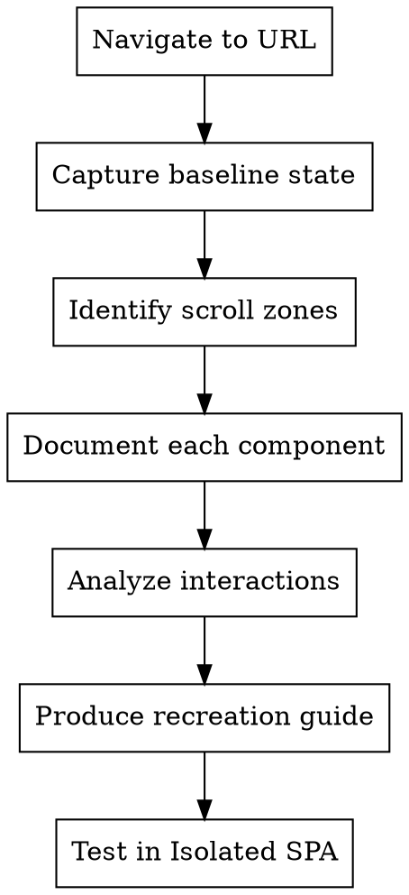

# Component Reverse Engineer (CCSS)

Reverse-engineer UI components from any URL for recreation. Analyzes visual behavior, DOM mutations, and CSS mechanisms to produce implementation-ready component documentation.

## When to Use

- Building UI without access to source code
- Recreating components from design references
- Understanding animation/interaction mechanisms
- Extracting behavioral patterns from existing sites
- Documenting component behavior for implementation

## Core Workflow



**Note:** Phase 8 enables testing each reverse-engineered component in a standalone SPA environment to verify behavior and interactions without page context.

## Phase 1: Page Capture

### Initial Navigation
1. Navigate to URL with `browser_navigate`
2. Wait for `networkidle` state
3. Take full-page screenshot (baseline)
4. Capture accessibility snapshot for DOM structure

### Viewport标准化
Test at consistent viewport sizes:
- Desktop: 1280x800
- Tablet: 768x1024
- Mobile: 375x812

```javascript
await page.setViewportSize({ width: 1280, height: 800 });
await page.goto(url);
await page.waitForLoadState('networkidle');
```

## Phase 2: Component Identification

### 2.1 Catalog ALL Containers (CRITICAL)

Before analyzing interactive elements, FIRST catalog ALL major containers on the page:

```javascript
// Get ALL major layout containers
await page.evaluate(() => {
  const containers = [];
  
  // Get direct children of body
  document.body.childNodes.forEach((node, i) => {
    if (node.nodeType !== 1) return; // Skip text nodes
    const el = node;
    const rect = el.getBoundingClientRect();
    if (rect.width < 10 || rect.height < 10) return; // Skip tiny elements
    
    containers.push({
      index: i,
      tag: el.tagName,
      id: el.id || '',
      classes: el.className || '',
      rect: { w: rect.width, h: rect.height, x: rect.x, y: rect.y },
      children: el.children.length,
      hasImages: el.querySelectorAll('img').length
    });
  });
  
  console.log('TOP-LEVEL CONTAINERS:', JSON.stringify(containers, null, 2));
});
```

**Why this matters:** Interactive elements often sync with SEPARATE containers elsewhere on the page (master-detail pattern). If you only look "inside" the accordion/list, you'll miss the image panel, media carousel, or detail pane that's controlled by the accordion but lives OUTSIDE it.

### 2.2 Identify Media Containers

Look for containers that contain ONLY media (images, video) and are NOT nested inside interactive elements:

```javascript
// Find "pure" media containers
await page.evaluate(() => {
  const mediaContainers = [];
  
  document.querySelectorAll('[class*="media"], [class*="image"], [class*="gallery"], [id*="media"], [id*="image"]').forEach(el => {
    const rect = el.getBoundingClientRect();
    const isInsideInteractive = el.closest('button, a, [role="button"], details');
    
    mediaContainers.push({
      tag: el.tagName,
      classes: el.className,
      id: el.id,
      rect: { w: rect.width, h: rect.height },
      isInsideInteractive: !!isInsideInteractive,
      childStructure: Array.from(el.children).map(c => c.tagName).join(', ')
    });
  });
  
  console.log('MEDIA CONTAINERS:', JSON.stringify(mediaContainers, null, 2));
});
```

### 2.3 Cross-Reference Interactive Elements with ALL Containers

After identifying interactive elements (accordion items, tabs, etc.), check if they sync with SEPARATE containers:

```javascript
// Check if clicking an accordion item affects a SEPARATE container
await page.evaluate(() => {
  // Get all elements with potential state-sync attributes
  const syncedContainers = [];
  
  // Look for containers with [data-*] or [class*="-sync"], [class*="-linked"]
  document.querySelectorAll('[data-linked], [data-sync], [data-ref], [data-panel]').forEach(el => {
    syncedContainers.push({
      tag: el.tagName,
      classes: el.className,
      attrs: Array.from(el.attributes).map(a => `${a.name}="${a.value}"`).join(' ')
    });
  });
  
  console.log('SYNCED CONTAINERS:', JSON.stringify(syncedContainers, null, 2));
});
```

### 2.4 Identify Scroll Zones

As you scroll down the page, note distinct **regions** that appear:

1. **Sticky headers/nav** - elements that persist during scroll
2. **Parallax sections** - backgrounds that move at different rates
3. **Reveal zones** - content that animates into view on scroll
4. **Sticky sidebars** - elements fixed to viewport edges
5. **Modal triggers** - elements that open overlays

For each zone, capture:
- Screenshot at entry
- Screenshot at mid-scroll
- Screenshot at exit
- DOM structure before/during/after

### Pattern Detection

Watch for these component types:

| Pattern | Visual Cue | DOM Indicator |
|---------|-----------|---------------|
| **Master-Detail** | Accordion/list + separate detail panel | Items share state with OUTSIDE container |
| **Carousel/Slider** | Items slide horizontally | Transform, translateX changes |
| **Accordion** | Content expands vertically | Height, max-height changes |
| **Tabs** | Content swaps without page change | Display, visibility changes |
| **Modal** | Overlay + centered content | Opacity, pointer-events, z-index |
| **Tooltip** | Small popup on hover | Position, display toggle |
| **Dropdown** | Menu appears below button | Transform: translateY |
| **Parallax** | Background moves slower | Transform: translateY with offset |
| **Sticky** | Element stays in viewport | Position: sticky, fixed |
| **Lazy load** | Content appears as scrolling | Intersection Observer triggers |

### Master-Detail Pattern Checklist

When you see an accordion or list, ALWAYS check:
- [ ] Is there a SEPARATE container outside the list that changes when items are clicked?
- [ ] Does the list have an attribute like `data-linked`, `data-ref`, or shared class that matches the media container?
- [ ] Take a screenshot BEFORE clicking, then AFTER clicking - compare to find the changed container
- [ ] Use MutationObserver (Phase 4.1) to detect ALL changes, not just inside the clicked element

## Phase 3: Interaction Analysis

### Hover Behavior
```javascript
// Capture hover state for each interactive element
await page.hover('selector');
await page.waitForTimeout(200); // Wait for transition
await page.screenshot({ path: 'hover-state.png' });
```

### Click/Active Behavior
```javascript
await page.click('selector');
await page.screenshot({ path: 'active-state.png' });
```

### Drag Behavior (for Carousels/Sliders)
```javascript
// Test drag interactions
const element = await page.locator('selector');
const box = await element.boundingBox();
await page.mouse.move(box.x + box.width / 2, box.y + box.height / 2);
await page.mouse.down();
await page.mouse.move(box.x - 100, box.y + box.height / 2);
await page.mouse.up();
await page.screenshot({ path: 'post-drag.png' });
```

### Scroll-Triggered Behavior
```javascript
// Monitor scroll position
await page.evaluate(() => {
  window.addEventListener('scroll', () => {
    console.log('Scroll:', window.scrollY);
  });
});
```

## Phase 4: DOM Monitoring

### 4.1 Watch-Everything Interaction Test (CRITICAL)

When testing ANY interaction, ALWAYS monitor the ENTIRE viewport for changes - not just the clicked element:

```javascript
// Before clicking, set up global mutation observer
await page.evaluate(() => {
  window.__interactionChanges = [];
  
  window.__mutationLogger = new MutationObserver((mutations) => {
    mutations.forEach(mutation => {
      if (mutation.type === 'attributes') {
        window.__interactionChanges.push({
          type: 'attr',
          target: mutation.target.className || mutation.target.id || mutation.target.tagName,
          attr: mutation.attributeName,
          oldValue: mutation.oldValue
        });
      }
      if (mutation.type === 'childList') {
        mutation.addedNodes.forEach(n => {
          if (n.nodeType === 1) {
            window.__interactionChanges.push({
              type: 'added',
              html: n.outerHTML?.substring(0, 150)
            });
          }
        });
      }
    });
  });
  
  window.__mutationLogger.observe(document.body, { 
    childList: true, 
    subtree: true, 
    attributes: true, 
    attributeOldValue: true 
  });
});

// NOW click the element
await page.click('.some-button');
await page.waitForTimeout(500);

// Stop and check what changed
const changes = await page.evaluate(() => {
  window.__mutationLogger?.disconnect();
  return window.__interactionChanges;
});

console.log('Everything that changed:', changes);
```

**Why this matters:** Interactions often affect SEPARATE elements elsewhere on the page - accordions sync with image panels, tabs change content containers, etc. Watching only the clicked element misses these links.

### 4.2 Before/After Snapshot Diff

Take a DOM snapshot before interaction, compare with after to discover structural changes:

```javascript
async function snapshotDiff(selector) {
  // Before state
  const before = await page.evaluate((sel) => {
    const el = document.querySelector(sel);
    if (!el) return null;
    return {
      html: el.innerHTML.substring(0, 500),
      siblingCount: el.parentElement?.children.length,
      children: Array.from(el.children).map(c => c.className.split(' ')[0])
    };
  }, selector);
  
  // Interact
  await page.click(selector);
  await page.waitForTimeout(500);
  
  // After state
  const after = await page.evaluate((sel) => {
    const el = document.querySelector(sel);
    if (!el) return null;
    return {
      html: el.innerHTML.substring(0, 500),
      siblingCount: el.parentElement?.children.length,
      children: Array.from(el.children).map(c => c.className.split(' ')[0])
    };
  }, selector);
  
  return {
    before,
    after,
    structuralChange: JSON.stringify(before) !== JSON.stringify(after)
  };
}
```

### 4.3 Track Transform Changes

### Capture Pseudo-class States

```javascript
// Force pseudo-states for inspection
await page.evaluate(() => {
  const el = document.querySelector('selector');
  // Check what styles apply on hover
  el.matches(':hover'); // triggers hover state
});
```

## Phase 5: Component Documentation

For each component identified, document:

### Component Card Template

```markdown
### [Component Name]

**Type:** [Carousel | Accordion | Modal | Tooltip | Master-Detail | etc.]

**Trigger:** [What activates it - hover, click, scroll, load]

**⚠️ CRITICAL - Interaction Discovery:**
Before documenting, run the "Watch-Everything Interaction Test" (Phase 4.1):
Click the element and observe what ELSE changes on the page.
Many patterns (accordions, tabs, master-detail) involve SEPARATE elements that sync state.

**⚠️ Master-Detail Check:**
If this is an accordion or list, ask:
- [ ] Is there a SEPARATE media/detail container that changes when items are clicked?
- [ ] What's the linking mechanism (data attribute, shared index, class)?
- [ ] Is the media container INSIDE or OUTSIDE this component?

**Visual Behavior:**
- Default: [screenshot reference]
- Hover: [screenshot reference]
- Active: [screenshot reference]
- Disabled: [if applicable]

**DOM Structure:**
```html
[structural HTML]
```

**Key CSS Properties:**
| Property | Value | Purpose |
|----------|-------|---------|
| display | flex | Layout |
| transform | translateX(-20px) | Animation |
| opacity | 0 | Visibility |

**Animation Details:**
- Duration: [ms]
- Easing: [cubic-bezier or ease]
- Property: [what animates]

**State Changes:**
| State | DOM Change | CSS Change |
|-------|------------|------------|
| Default | - | opacity: 1 |
| Hover | class added | opacity: 0.8, box-shadow appears |
| Active | class added | transform: scale(0.98) |

**Linked Components:**
If interaction causes changes ELSEWHERE on the page (common with accordions, tabs, master-detail patterns), document:
- [This Component] → [Other Component] via [class/data attribute sync]
- State sharing mechanism: [e.g., both elements get 'is-active' when clicked]
- SEPARATE container if applicable: [name, location in DOM, how it syncs]

**Recreation Notes:**
[Implementation hints]
```

## Phase 6: Parallax-Specific Analysis

When you observe parallax effects:

1. **Identify parallax layers** - multiple backgrounds at different depths
2. **Calculate parallax ratio** - how much does each layer move per scroll unit
3. **Capture transition points** - when does parallax start/stop

```javascript
// Measure parallax behavior
await page.evaluate(() => {
  let lastScroll = 0;
  let observations = [];

  const observer = new IntersectionObserver((entries) => {
    entries.forEach(entry => {
      observations.push({
        scrollY: window.scrollY,
        elementTop: entry.boundingClientRect.top,
        elementBottom: entry.boundingClientRect.bottom,
        ratio: entry.intersectionRatio
      });
    });
  });

  document.querySelectorAll('[data-parallax]').forEach(el => {
    observer.observe(el);
  });

  window.addEventListener('scroll', () => {
    const scrollDelta = window.scrollY - lastScroll;
    lastScroll = window.scrollY;
    // Log scroll delta for analysis
  }, { passive: true });
});
```

## Phase 7: Carousel-Specific Analysis

For carousels/sliders:

1. **Identify navigation** - arrows, dots, swipe, scroll
2. **Test each navigation type**
3. **Measure item dimensions** - width, gap, visible count
4. **Check loop behavior** - infinite or bounded
5. **Capture autoplay timing** - if applicable

```javascript
// Analyze carousel mechanics
await page.evaluate(() => {
  const carousel = document.querySelector('.carousel');
  const track = carousel.querySelector('.carousel-track');
  const items = track.querySelectorAll('.carousel-item');

  console.log('Items:', items.length);
  console.log('Item width:', items[0].getBoundingClientRect().width);
  console.log('Track transform:', window.getComputedStyle(track).transform);

  // Check for data attributes indicating position
  const activeItem = track.querySelector('.active');
  if (activeItem) {
    console.log('Active index:', [...items].indexOf(activeItem));
  }
});
```

## Output Format

Produce a structured recreation guide:

```markdown
# Component Recreation Guide: [Page Name]

## URL
[original URL]

## Viewport Tested
[1280x800 / 768x1024 / 375x812]

---

## Components Identified

### 1. [Hero Section]
[Component card as above]

### 2. [Navigation Bar]
[Component card]

### 3. [Talent Cards Grid]
[Component card]

[... continue for each component]

---

## CSS Variables Identified
[Collect any CSS custom properties found]

## Animation Timing
| Component | Duration | Easing | Trigger |
|-----------|----------|--------|---------|
| Header fade | 300ms | ease-out | scroll |
| Card hover | 200ms | cubic-bezier(0.4, 0, 0.2, 1) | hover |

## Implementation Priority
1. [Most complex/time-sensitive component]
2. [Next priority]
...
```

## Common Mistakes

1. **Not capturing enough states** - hover, active, disabled all matter
2. **Missing transition timing** - assume instant when it's animated
3. **Ignoring pseudo-elements** - ::before, ::after often used for decorations
4. **Forgetting scroll-linked animations** - parallax uses scroll events, not just CSS
5. **Not testing navigation** - carousels need arrow/dot/swipe all tested
6. **Only watching the clicked element** - interactions often affect SEPARATE elements elsewhere. ALWAYS use mutation observer to watch the whole viewport
7. **Missing separate media containers** - Master-detail patterns often have a SEPARATE container (image panel, media carousel) that syncs with the list but lives OUTSIDE it. ALWAYS catalog ALL top-level containers before analyzing
8. **Assuming images are inside interactive elements** - When you see an accordion with images, the first instinct is "images are inside each accordion item". But often they're in a SEPARATE shared container. Check the full DOM structure, not just the visible hierarchy.

## Integration with Other Skills

- **ccss-frontend-dev-cycle** - Use for iterative visual testing
- **superpowers:writing-plans** - Convert recreation guide into implementation tasks
- **frontend-design** - For design token extraction

## Phase 8: Isolated Component SPA Testing

After reverse-engineering a component, test it in isolation using a standalone SPA environment.

### Session Folder Structure

Create a dedicated folder for all reverse-engineering session artifacts:

```bash
# Create session folder with timestamp
SESSION_FOLDER="./reverse-engineering/[url-hostname]-[timestamp]/"
# Example: ./reverse-engineering/jeskojets-com-2026-04-16/

mkdir -p "$SESSION_FOLDER"
cd "$SESSION_FOLDER"

# Subfolders
├── screenshots/     # Page & component screenshots
├── components/       # Individual component HTML/CSS/JS files
├── states/          # State-specific screenshots (hover, active, etc.)
└── exports/         # Final component packages for export
```

**CRITICAL:** When the reverse-engineering session is complete, clean up the folder:
```bash
# Delete entire session folder when done
rm -rf "./reverse-engineering/[session-folder]"
```

Or use the cleanup function:
```javascript
async function cleanupSession(folderPath) {
  await page.evaluate((path) => {
    // Use fs in Node.js or shell command to delete
    const { execSync } = require('child_process');
    execSync(`rm -rf ${path}`);
  }, folderPath);
}
```

### Create Isolated Test Page

Generate an HTML file with the component running in a minimal shell (saved to `components/` folder):

```html
<!DOCTYPE html>
<html>
<head>
  <meta charset="UTF-8">
  <meta name="viewport" content="width=device-width, initial-scale=1.0">
  <title>Component Test: [Component Name]</title>
  <style>
    /* CSS Variables from reverse-engineering */
    :root {
      --component-bg: #fff8ed;
      --component-text: #312726;
      /* ... add extracted CSS variables ... */
    }
    
    /* Reset + Component Styles */
    * { box-sizing: border-box; margin: 0; padding: 0; }
    body { 
      font-family: system-ui, sans-serif; 
      background: var(--component-bg); 
      color: var(--component-text);
      min-height: 100vh;
    }
    
    /* Component CSS goes here */
    .component { /* ... */ }
    .component:hover { /* ... */ }
  </style>
</head>
<body>
  <!-- Component HTML goes here -->
  <div class="component">
    <!-- ... -->
  </div>
  
  <!-- Component JS (if any) -->
  <script>
    // Interaction handlers
  </script>
</body>
</html>
```

### Automated Test Page Generation

Use this function to generate isolated test pages for each component:

```javascript
async function generateComponentTestPage(componentData) {
  const { name, html, css, js, variables, screenshot } = componentData;
  
  return `<!DOCTYPE html>
<html>
<head>
  <title>Test: ${name}</title>
  <style>
    :root { ${Object.entries(variables).map(([k,v]) => `${k}: ${v}`).join('; ')} }
    * { box-sizing: border-box; margin: 0; padding: 0; }
    body { 
      min-height: 100vh; 
      display: flex; 
      align-items: center; 
      justify-content: center;
      padding: 2rem;
    }
    .test-container {
      width: 100%;
      max-width: ${componentData.maxWidth || '800px'};
    }
    ${css}
  </style>
</head>
<body>
  <div class="test-container">
    ${html}
  </div>
  ${js ? `<script>${js}</script>` : ''}
</body>
</html>`;
}
```

### Test Each Component State

For each component, test these states in isolation:

1. **Default State** - Load component without interaction
2. **Hover State** - Simulate mouse hover
3. **Active/Focus State** - Simulate click/keyboard focus
4. **Disabled State** - If applicable
5. **Responsive Breakpoints** - Test at different viewport sizes

```javascript
// Test component states in isolation
async function testComponentStates(component) {
  await page.goto(`data:text/html,${encodeURIComponent(testPage)}`);
  
  // Default
  await page.waitForLoadState('networkidle');
  await page.screenshot({ path: `${component}-default.png` });
  
  // Hover
  await page.hover('.component');
  await page.waitForTimeout(300);
  await page.screenshot({ path: `${component}-hover.png` });
  
  // Active
  await page.click('.component');
  await page.waitForTimeout(300);
  await page.screenshot({ path: `${component}-active.png` });
  
  // Mobile viewport
  await page.setViewportSize({ width: 375, height: 812 });
  await page.screenshot({ path: `${component}-mobile.png` });
}
```

### Component State Matrix

Document all states for each component:

**⚠️ IMPORTANT: After component testing, run sessionCleanup() to delete screenshots**

| Component | Default | Hover | Active | Disabled | Mobile |
|-----------|---------|-------|--------|----------|--------|
| Benefits Card | ✅ | ✅ | ✅ | N/A | ✅ |
| Jet Switcher | ✅ | ✅ | ✅ | N/A | ✅ |
| CTA Button | ✅ | ✅ | ✅ | ✅ | ✅ |

### Inline Component Testing in Main SPA

For testing within the original page context:

```javascript
// Session folder for saving screenshots
const SESSION_FOLDER = './reverse-engineering/[session]/';

// Isolate a component by hiding everything else
async function isolateComponent(selector, componentName) {
  const folder = SESSION_FOLDER + 'screenshots/';
  
  await page.evaluate((sel) => {
    // Clone component
    const component = document.querySelector(sel);
    const clone = component.cloneNode(true);
    
    // Create test container
    const container = document.createElement('div');
    container.id = 'component-isolator';
    container.style.cssText = `
      position: fixed;
      inset: 0;
      z-index: 99999;
      background: white;
      overflow: auto;
      padding: 2rem;
    `;
    container.appendChild(clone);
    document.body.appendChild(container);
    
    // Hide original page
    document.body.style.visibility = 'hidden';
  }, selector);
  
  await page.screenshot({ path: `${folder}${componentName}-isolated.png` });
}

// Restore original page
async function restorePage() {
  await page.evaluate(() => {
    document.getElementById('component-isolator')?.remove();
    document.body.style.visibility = 'visible';
  });
}

// Clean up entire session folder
async function cleanupSession() {
  await page.evaluate(() => {
    const { execSync } = require('child_process');
    execSync(`rm -rf ${SESSION_FOLDER}`);
  });
  console.log(`✅ Session folder cleaned: ${SESSION_FOLDER}`);
}
```

### Export Component Package

For each component, export a complete test package:

```markdown
## Component Package: [Name]

### Files
- `index.html` - Standalone test page
- `component.css` - Extracted styles
- `component.html` - Component markup
- `component.js` - Interactions (if any)
- `states/` - Screenshots of all states

### Usage
1. Open `index.html` in browser
2. Test all interaction states
3. Verify responsive behavior
4. Copy styles to your project
```

### Session Cleanup

**CRITICAL: After EVERY reverse-engineering session, clean up ALL artifacts:**

1. **Screenshot files** - `*.png` in project root
2. **Playwright MCP logs** - `.playwright-mcp/` folder
3. **Session folders** - `./reverse-engineering/[session]/`

```bash
# Clean up EVERYTHING after session
cd [project-root]
rm -f *.png
rm -rf .playwright-mcp/
rm -rf ./reverse-engineering/

# If session folder exists
rm -rf "./reverse-engineering/[session-name]/"
```

**Automatic cleanup checklist (run after each session):**
```javascript
async function sessionCleanup(projectRoot) {
  const fs = require('fs');
  const path = require('path');
  
  // Delete PNG files
  const pngs = fs.readdirSync(projectRoot).filter(f => f.endsWith('.png'));
  pngs.forEach(f => fs.unlinkSync(path.join(projectRoot, f)));
  console.log(`🗑️ Deleted ${pngs.length} PNG files`);
  
  // Delete .playwright-mcp folder
  const pmcp = path.join(projectRoot, '.playwright-mcp');
  if (fs.existsSync(pmcp)) {
    fs.rmSync(pmcp, { recursive: true });
    console.log('🗑️ Deleted .playwright-mcp folder');
  }
  
  // Delete reverse-engineering folder
  const re = path.join(projectRoot, 'reverse-engineering');
  if (fs.existsSync(re)) {
    fs.rmSync(re, { recursive: true });
    console.log('🗑️ Deleted reverse-engineering folder');
  }
  
  console.log('✅ Session cleanup complete');
}
```

**Important:** The session folder contains temporary screenshots and test files only. Once you've verified the component implementation in your project, clean up to save disk space.

## Quick Reference

| Tool | Purpose |
|------|---------|
| `browser_navigate` | Load URL |
| `browser_snapshot` | Get accessibility tree |
| `browser_take_screenshot` | Capture visual states |
| `browser_evaluate` | Run JS for DOM monitoring |
| `browser_hover` | Trigger hover states |
| `browser_click` | Trigger click states |
| `browser_resize` | Test responsive behavior |

## Phase 9: Advanced Monitoring Utilities

Add these utilities to overcome common reverse-engineering bottlenecks:

### 9.1 Animation Timing Detector

Automatically detect transition/animation durations and easing from any element:

```javascript
async function detectAnimationTiming(selector) {
  return await page.evaluate((sel) => {
    const el = document.querySelector(sel);
    if (!el) return null;
    
    const style = window.getComputedStyle(el);
    return {
      transitionDuration: style.transitionDuration,
      transitionTimingFunction: style.transitionTimingFunction,
      animationDuration: style.animationDuration,
      animationTimingFunction: style.animationTimingFunction,
      // Get all transition properties
      transitions: style.transition.split(',').map(t => t.trim()),
      // Parse cubic-bezier if present
      easing: style.transitionTimingFunction.match(/cubic-bezier\(([^)]+)\)/)?.[1]
    };
  }, selector);
}

// Usage: Get timing from original component
const timing = await detectAnimationTiming('.benefits-card');
console.log('Animation:', timing);
// Output: { transitionDuration: "1s", transitionTimingFunction: "cubic-bezier(0.23, 1, 0.32, 1)", ... }
```

### 9.2 Freeze Hover State

Capture hover state without mouse-jumping issues:

```javascript
async function freezeHoverState(selector, outputPath) {
  await page.evaluate((sel) => {
    const el = document.querySelector(sel);
    // Force hover state via class (add .freeze-hover to CSS)
    el.classList.add('freeze-hover');
  }, selector);
  
  // Take screenshot while state is frozen
  await page.screenshot({ path: outputPath });
  
  // Restore
  await page.evaluate((sel) => {
    document.querySelector(sel)?.classList.remove('freeze-hover');
  }, selector);
}

// Add to page styles (run once):
await page.addStyleTag({
  content: `
    .freeze-hover, .freeze-hover * {
      transition: none !important;
      animation: none !important;
    }
    .freeze-hover:hover {
      /* Copy computed hover styles here */
    }
  `
});
```

### 9.3 Intersection Observer Monitor

Track which component is in viewport and its state changes:

```javascript
async function monitorVisibility(selector) {
  await page.evaluate((sel) => {
    const el = document.querySelector(sel);
    if (!el) return;
    
    window.__visibilityLog = [];
    
    const observer = new IntersectionObserver((entries) => {
      entries.forEach(entry => {
        window.__visibilityLog.push({
          target: sel,
          isIntersecting: entry.isIntersecting,
          intersectionRatio: entry.intersectionRatio,
          boundingRect: entry.boundingClientRect,
          scrollY: window.scrollY,
          timestamp: Date.now()
        });
      });
    }, { threshold: [0, 0.5, 1] });
    
    observer.observe(el);
    window.__intersectionObserver = observer;
  }, selector);
}

// Get logs after scrolling
await page.evaluate(() => window.scrollTo(0, 500));
await page.waitForTimeout(500);
const logs = await page.evaluate(() => window.__visibilityLog);
console.log('Visibility changes:', logs);
```

### 9.4 Batch State Screenshot

Capture all interactive states without manual interaction:

```javascript
async function captureAllStates(selector, basePath) {
  const states = ['default', 'hover', 'active', 'focus', 'disabled'];
  
  for (const state of states) {
    await page.goto('data:text/html,<style>body{margin:0}</style>');
    // Inject component
    await page.evaluate((s) => {
      document.body.innerHTML = document.querySelector(s)?.outerHTML || '';
    }, selector);
    
    switch(state) {
      case 'hover':
        await page.hover('body > *');
        break;
      case 'active':
        await page.click('body > *');
        break;
      case 'focus':
        await page.focus('body > *');
        break;
      case 'disabled':
        await page.evaluate(() => {
          document.querySelector('body > *')?.setAttribute('disabled', '');
        });
        break;
    }
    
    await page.waitForTimeout(300);
    await page.screenshot({ path: `${basePath}-${state}.png` });
  }
}
```

### 9.5 Live Selector Refresher

Get fresh DOM refs without losing context:

```javascript
// Instead of caching refs like @e123, use selector-based lookup
async function getFreshRef(selector) {
  const el = await page.locator(selector).first();
  const box = await el.boundingBox();
  return { el, box, selector };
}

// Track element through interactions
async function clickAndTrack(selector, action = 'click') {
  const tracked = [];
  
  for (let i = 0; i < 3; i++) {
    const ref = await getFreshRef(selector);
    tracked.push({
      iteration: i,
      box: ref.box,
      classes: await ref.el.getAttribute('class'),
      timestamp: Date.now()
    });
    
    if (action === 'click') await ref.el.click();
    else if (action === 'hover') await ref.el.hover();
    await page.waitForTimeout(500);
  }
  
  return tracked;
}
```

### 9.6 CSS Variable Dumper

Extract all CSS custom properties from a page/section:

```javascript
async function dumpCSSVariables(selector) {
  return await page.evaluate((sel) => {
    const el = document.querySelector(sel);
    const root = el || document.documentElement;
    const style = getComputedStyle(root);
    
    const vars = {};
    for (const prop of style) {
      if (prop.startsWith('--')) {
        vars[prop] = style.getPropertyValue(prop).trim();
      }
    }
    return vars;
  }, selector);
}

// Usage
const vars = await dumpCSSVariables('.benefits-s');
console.log('CSS Variables:', vars);
// Output: { '--color-bg': '#fff8ed', '--spacing-unit': '0.833em', ... }
```

### 9.7 Session Auto-Cleanup

Ensure cleanup happens even if session is interrupted:

```javascript
// Call at start of reverse-engineering session
async function initSession(sessionName) {
  const SESSION_PATH = `./reverse-engineering/${sessionName}/`;
  
  // Create folder structure
  await page.evaluate((path) => {
    // Can't create folders from browser, log for shell execution
    console.log('MKDIR:', path);
    console.log('MKDIR:', path + 'screenshots/');
    console.log('MKDIR:', path + 'states/');
    console.log('MKDIR:', path + 'components/');
  }, SESSION_PATH);
  
  // Schedule cleanup reminder
  console.log('📌 Session started. Remember to run cleanupSession() when done.');
  console.log('   Cleanup command: rm -rf "' + SESSION_PATH + '"');
  
  return SESSION_PATH;
}

// Call at end
async function cleanupSession(sessionPath) {
  await page.evaluate((path) => {
    // Delete via shell
    const { execSync } = require('child_process');
    try {
      execSync(`rm -rf "${path}"`);
      console.log('✅ Session cleaned:', path);
    } catch(e) {
      console.log('⚠️ Cleanup failed:', e.message);
    }
  }, sessionPath);
}
```

### 9.8 Quick Comparison Mode

Side-by-side original vs implementation comparison:

```javascript
// Open original in one tab, implementation in another
async function compareComponents(originalUrl, implUrl, selector) {
  // Screenshot original
  await page.goto(originalUrl);
  await page.evaluate((sel) => document.querySelector(sel)?.scrollIntoView(), selector);
  await page.screenshot({ path: 'compare-original.png' });
  
  // Screenshot implementation
  await page.goto(implUrl);
  await page.evaluate((sel) => document.querySelector(sel)?.scrollIntoView(), selector);
  await page.screenshot({ path: 'compare-impl.png' });
  
  // Log dimensions for comparison
  const dims = await page.evaluate((sel) => {
    const el = document.querySelector(sel);
    if (!el) return null;
    const rect = el.getBoundingClientRect();
    return { width: rect.width, height: rect.height, top: rect.top };
  }, selector);
  
  console.log('Implementation dimensions:', dims);
  console.log('📁 Screenshots saved: compare-original.png, compare-impl.png');
}
```