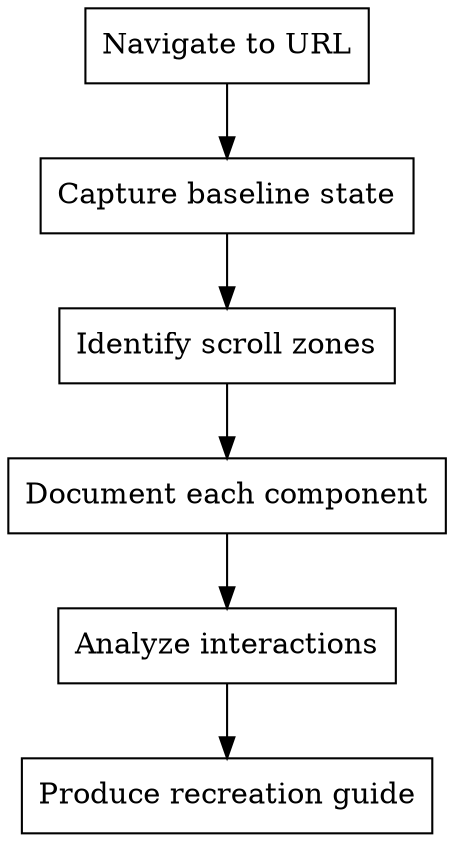

# Component Reverse Engineer (CCSS)

Reverse-engineer UI components from any URL for recreation. Analyzes visual behavior, DOM mutations, and CSS mechanisms to produce implementation-ready component documentation.

## When to Use

- Building UI without access to source code
- Recreating components from design references
- Understanding animation/interaction mechanisms
- Extracting behavioral patterns from existing sites
- Documenting component behavior for implementation

## Core Workflow



## Phase 1: Page Capture

### Initial Navigation
1. Navigate to URL with `browser_navigate`
2. Wait for `networkidle` state
3. Take full-page screenshot (baseline)
4. Capture accessibility snapshot for DOM structure

### Viewport标准化
Test at consistent viewport sizes:
- Desktop: 1280x800
- Tablet: 768x1024
- Mobile: 375x812

```javascript
await page.setViewportSize({ width: 1280, height: 800 });
await page.goto(url);
await page.waitForLoadState('networkidle');
```

## Phase 2: Component Identification

### Identify Scroll Zones

As you scroll down the page, note distinct **regions** that appear:

1. **Sticky headers/nav** - elements that persist during scroll
2. **Parallax sections** - backgrounds that move at different rates
3. **Reveal zones** - content that animates into view on scroll
4. **Sticky sidebars** - elements fixed to viewport edges
5. **Modal triggers** - elements that open overlays

For each zone, capture:
- Screenshot at entry
- Screenshot at mid-scroll
- Screenshot at exit
- DOM structure before/during/after

### Pattern Detection

Watch for these component types:

| Pattern | Visual Cue | DOM Indicator |
|---------|-----------|---------------|
| **Carousel/Slider** | Items slide horizontally | Transform, translateX changes |
| **Accordion** | Content expands vertically | Height, max-height changes |
| **Tabs** | Content swaps without page change | Display, visibility changes |
| **Modal** | Overlay + centered content | Opacity, pointer-events, z-index |
| **Tooltip** | Small popup on hover | Position, display toggle |
| **Dropdown** | Menu appears below button | Transform: translateY |
| **Parallax** | Background moves slower | Transform: translateY with offset |
| **Sticky** | Element stays in viewport | Position: sticky, fixed |
| **Lazy load** | Content appears as scrolling | Intersection Observer triggers |

## Phase 3: Interaction Analysis

### Hover Behavior
```javascript
// Capture hover state for each interactive element
await page.hover('selector');
await page.waitForTimeout(200); // Wait for transition
await page.screenshot({ path: 'hover-state.png' });
```

### Click/Active Behavior
```javascript
await page.click('selector');
await page.screenshot({ path: 'active-state.png' });
```

### Drag Behavior (for Carousels/Sliders)
```javascript
// Test drag interactions
const element = await page.locator('selector');
const box = await element.boundingBox();
await page.mouse.move(box.x + box.width / 2, box.y + box.height / 2);
await page.mouse.down();
await page.mouse.move(box.x - 100, box.y + box.height / 2);
await page.mouse.up();
await page.screenshot({ path: 'post-drag.png' });
```

### Scroll-Triggered Behavior
```javascript
// Monitor scroll position
await page.evaluate(() => {
  window.addEventListener('scroll', () => {
    console.log('Scroll:', window.scrollY);
  });
});
```

## Phase 4: DOM Monitoring

### Monitor Style Changes

Use `browser_evaluate` to watch CSS changes:

```javascript
await page.evaluate(() => {
  const target = document.querySelector('selector');
  const observer = new MutationObserver((mutations) => {
    mutations.forEach((mutation) => {
      if (mutation.type === 'attributes') {
        console.log('Attribute changed:', mutation.attributeName);
        console.log('New value:', target.style.cssText);
      }
    });
  });
  observer.observe(target, { attributes: true, subtree: true });
});
```

### Track Transform Changes

```javascript
await page.evaluate(() => {
  const target = document.querySelector('.element');
  setInterval(() => {
    const style = window.getComputedStyle(target);
    console.log('Transform:', style.transform);
    console.log('Translate:', style.translate);
  }, 100);
});
```

### Capture Pseudo-class States

```javascript
// Force pseudo-states for inspection
await page.evaluate(() => {
  const el = document.querySelector('selector');
  // Check what styles apply on hover
  el.matches(':hover'); // triggers hover state
});
```

## Phase 5: Component Documentation

For each component identified, document:

### Component Card Template

```markdown
### [Component Name]

**Type:** [Carousel | Accordion | Modal | Tooltip | etc.]

**Trigger:** [What activates it - hover, click, scroll, load]

**Visual Behavior:**
- Default: [screenshot reference]
- Hover: [screenshot reference]
- Active: [screenshot reference]
- Disabled: [if applicable]

**DOM Structure:**
```html
[structural HTML]
```

**Key CSS Properties:**
| Property | Value | Purpose |
|----------|-------|---------|
| display | flex | Layout |
| transform | translateX(-20px) | Animation |
| opacity | 0 | Visibility |

**Animation Details:**
- Duration: [ms]
- Easing: [cubic-bezier or ease]
- Property: [what animates]

**State Changes:**
| State | DOM Change | CSS Change |
|-------|------------|------------|
| Default | - | opacity: 1 |
| Hover | class added | opacity: 0.8, box-shadow appears |
| Active | class added | transform: scale(0.98) |

**Recreation Notes:**
[Implementation hints]
```

## Phase 6: Parallax-Specific Analysis

When you observe parallax effects:

1. **Identify parallax layers** - multiple backgrounds at different depths
2. **Calculate parallax ratio** - how much does each layer move per scroll unit
3. **Capture transition points** - when does parallax start/stop

```javascript
// Measure parallax behavior
await page.evaluate(() => {
  let lastScroll = 0;
  let observations = [];

  const observer = new IntersectionObserver((entries) => {
    entries.forEach(entry => {
      observations.push({
        scrollY: window.scrollY,
        elementTop: entry.boundingClientRect.top,
        elementBottom: entry.boundingClientRect.bottom,
        ratio: entry.intersectionRatio
      });
    });
  });

  document.querySelectorAll('[data-parallax]').forEach(el => {
    observer.observe(el);
  });

  window.addEventListener('scroll', () => {
    const scrollDelta = window.scrollY - lastScroll;
    lastScroll = window.scrollY;
    // Log scroll delta for analysis
  }, { passive: true });
});
```

## Phase 7: Carousel-Specific Analysis

For carousels/sliders:

1. **Identify navigation** - arrows, dots, swipe, scroll
2. **Test each navigation type**
3. **Measure item dimensions** - width, gap, visible count
4. **Check loop behavior** - infinite or bounded
5. **Capture autoplay timing** - if applicable

```javascript
// Analyze carousel mechanics
await page.evaluate(() => {
  const carousel = document.querySelector('.carousel');
  const track = carousel.querySelector('.carousel-track');
  const items = track.querySelectorAll('.carousel-item');

  console.log('Items:', items.length);
  console.log('Item width:', items[0].getBoundingClientRect().width);
  console.log('Track transform:', window.getComputedStyle(track).transform);

  // Check for data attributes indicating position
  const activeItem = track.querySelector('.active');
  if (activeItem) {
    console.log('Active index:', [...items].indexOf(activeItem));
  }
});
```

## Output Format

Produce a structured recreation guide:

```markdown
# Component Recreation Guide: [Page Name]

## URL
[original URL]

## Viewport Tested
[1280x800 / 768x1024 / 375x812]

---

## Components Identified

### 1. [Hero Section]
[Component card as above]

### 2. [Navigation Bar]
[Component card]

### 3. [Talent Cards Grid]
[Component card]

[... continue for each component]

---

## CSS Variables Identified
[Collect any CSS custom properties found]

## Animation Timing
| Component | Duration | Easing | Trigger |
|-----------|----------|--------|---------|
| Header fade | 300ms | ease-out | scroll |
| Card hover | 200ms | cubic-bezier(0.4, 0, 0.2, 1) | hover |

## Implementation Priority
1. [Most complex/time-sensitive component]
2. [Next priority]
...
```

## Common Mistakes

1. **Not capturing enough states** - hover, active, disabled all matter
2. **Missing transition timing** - assume instant when it's animated
3. **Ignoring pseudo-elements** - ::before, ::after often used for decorations
4. **Forgetting scroll-linked animations** - parallax uses scroll events, not just CSS
5. **Not testing navigation** - carousels need arrow/dot/swipe all tested

## Integration with Other Skills

- **ccss-frontend-dev-cycle** - Use for iterative visual testing
- **superpowers:writing-plans** - Convert recreation guide into implementation tasks
- **frontend-design** - For design token extraction

## Quick Reference

| Tool | Purpose |
|------|---------|
| `browser_navigate` | Load URL |
| `browser_snapshot` | Get accessibility tree |
| `browser_take_screenshot` | Capture visual states |
| `browser_evaluate` | Run JS for DOM monitoring |
| `browser_hover` | Trigger hover states |
| `browser_click` | Trigger click states |
| `browser_resize` | Test responsive behavior |